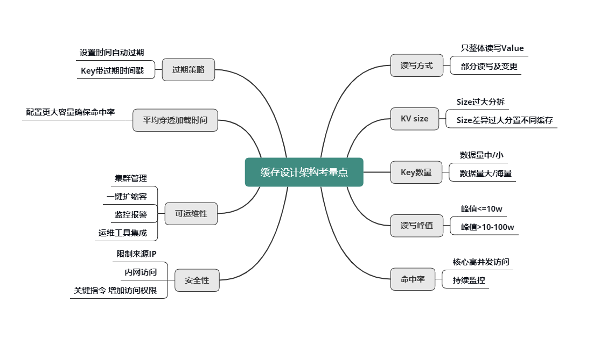
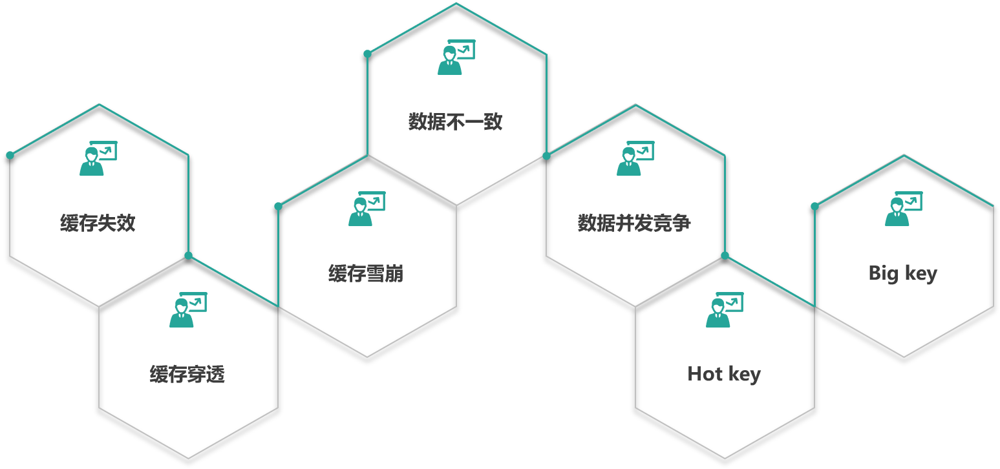
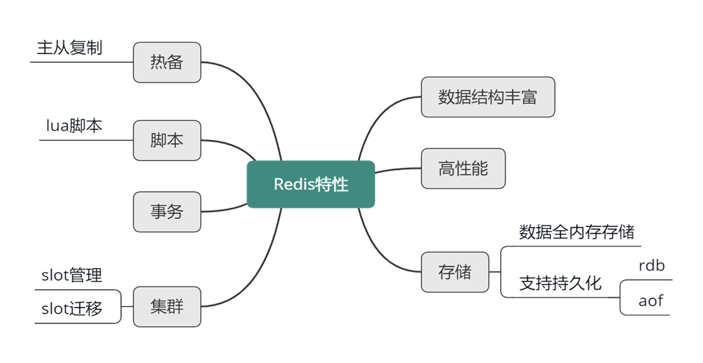
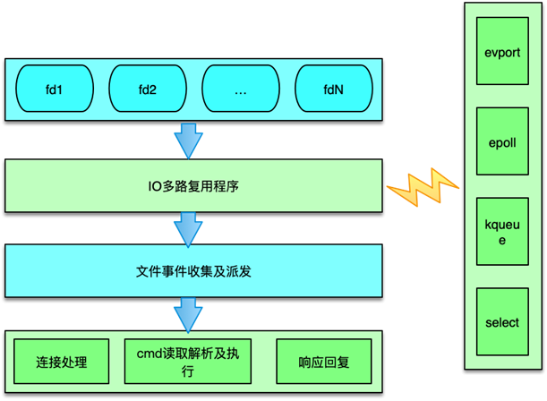
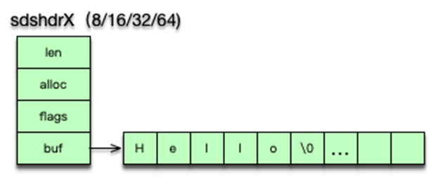
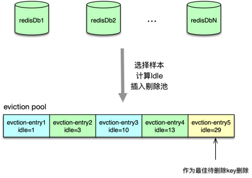
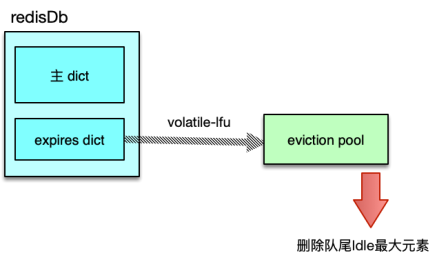
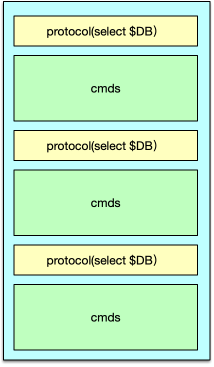
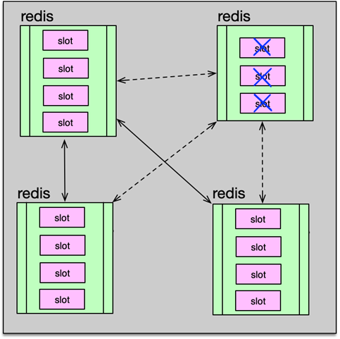
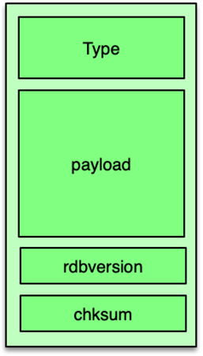

## 需要解决的问题

随着互联网从门户/搜索时代进入移动社交时代，互联网产品也从满足用户单向浏览的需求，发展为满足用户个性信息获取及社交的需求。这就要求产品做到以用户和关系为基础，对海量数据进行实时分析计算。也就意味着，用户的每次请求，服务后端都要查询用户的个人信息、社交关系图谱，以及关系图谱涉及到的大量关联信息。还要将这些信息进行聚合、过滤、筛选和排序，最终响应给用户。如果这些信息全部从 DB 中加载，将会是一个无法忍受的漫长等待过程。

而缓存的使用，是提升系统性能、改善用户体验的唯一解决之道。

## 缓存的基本思想


缓存构建的基本思想是利用时间局限性原理（**内存局部性原理**），通过空间换时间来达到加速数据获取的目的，同时由于缓存空间的成本较高，在实际设计架构中还要考虑访问延迟和成本的权衡问题。这里面有 3 个关键点：

- 一是内存局部性原理，即被获取过一次的数据在未来会被多次引用，比如一条微博被一个人感兴趣并阅读后，它大概率还会被更多人阅读，当然如果变成热门微博后，会被数以百万/千万计算的更多用户查看。
- 二是以空间换时间，因为原始数据获取太慢，所以我们开辟一块高速独立空间，提供高效访问，来达到数据获取加速的目的。
- 三是性能成本 Tradeoff，构建系统时希望系统的访问性能越高越好，访问延迟越低小越好。但维持相同数据规模的存储及访问，性能越高延迟越小，成本也会越高，所以在系统架构设计时，你需要在系统性能和开发运行成本之间做取舍。比如左边这张图，相同成本的容量，SSD 硬盘容量会比内存大 10～30 倍以上，但读写延迟却高 50～100 倍。

## 缓存的优势

缓存的优势主要有以下几点：

- 提升访问性能
- 降低网络拥堵
- 减轻服务负载
- 增强可扩展性

通过缓存存储原始数据，可以大幅提升访问性能。不过在实际业务场景中，缓存中存储的往往是需要频繁访问的中间数据甚至最终结果，这些数据相比 DB 中的原始数据小很多，这样就可以减少网络流量，降低网络拥堵，同时由于减少了解析和计算，调用方和存储服务的负载也可以大幅降低。缓存的读写性能很高，预热快，在数据访问存在性能瓶颈或遇到突发流量，系统读写压力大增时，可以快速部署上线，同时在流量稳定后，也可以随时下线，从而使系统的可扩展性大大增强。

## 缓存的代价

任何事情都有两面性，缓存也不例外，我们在享受缓存带来一系列好处的同时，也注定需要付出一定的代价：

- 首先，服务系统中引入缓存，会增加系统的复杂度。
- 其次，由于缓存相比原始 DB 存储的成本更高，所以系统部署及运行的费用也会更高。
- 最后，由于一份数据同时存在缓存和 DB 中，甚至缓存内部也会有多个数据副本，多份数据就会存在一致性问题，同时缓存体系本身也会存在可用性问题和分区的问题。这就需要我们加强对缓存原理、缓存组件以及优秀缓存体系实践的理解，从系统架构之初就对缓存进行良好设计，降低缓存引入的副作用，让缓存体系成为服务系统高效稳定运行的强力基石。

一般来讲，服务系统的全量原始数据存储在 DB 中（如 MySQL、HBase 等），所有数据的读写都可以通过 DB 操作来获取。但 DB 读写性能低、延迟高，如 MySQL 单实例的读写 QPS 通常只有千级别（3000～6000），读写平均耗时 10～100ms 级别，如果一个用户请求需要查 20 个不同的数据来聚合，仅仅 DB 请求就需要数百毫秒甚至数秒。而 cache 的读写性能正好可以弥补 DB 的不足，比如 Memcached 的读写 QPS 可以达到 10～100万 级别，读写平均耗时在 1ms 以下，结合并发访问技术，单个请求即便查上百条数据，也可以轻松应对。

但 cache 容量小，只能存储部分访问频繁的热数据，同时，同一份数据可能同时存在 cache 和 DB，如果处理不当，就会出现数据不一致的问题。所以服务系统在处理业务请求时，需要对 cache 的读写方式进行适当设计，既要保证数据高效返回，又要尽量避免数据不一致等各种问题。

## 缓存的读写模式

如下图，业务系统读写缓存有 3 种模式：

- Cache Aside（旁路缓存）
- Read/Write Through（读写穿透）
- Write Behind Caching（异步缓存写入）


### Cache Aside


如上图所示，Cache Aside 模式中，业务应用方对于写，是更新 DB 后，直接将 key 从 cache 中删除，然后由 DB 驱动缓存数据的更新；而对于读，是先读 cache，如果 cache 没有，则读 DB，同时将从 DB 中读取的数据回写到 cache。

这种模式的特点是，业务端处理所有数据访问细节，同时利用 Lazy 计算的思想，更新 DB 后，直接删除 cache 并通过 DB 更新，确保数据以 DB 结果为准，则可以大幅降低 cache 和 DB 中数据不一致的概率。

如果没有专门的存储服务，同时是对数据一致性要求比较高的业务，或者是缓存数据更新比较复杂的业务，这些情况都比较适合使用 Cache Aside 模式。如微博发展初期，不少业务采用这种模式，这些缓存数据需要通过多个原始数据进行计算后设置。在部分数据变更后，直接删除缓存。同时，使用一个 Trigger 组件，实时读取 DB 的变更日志，然后重新计算并更新缓存。如果读缓存的时候，Trigger 还没写入 cache，则由调用方自行到 DB 加载计算并写入 cache。

### Read/Write Through


如上图，对于 Cache Aside 模式，业务应用需要同时维护 cache 和 DB 两个数据存储方，过于繁琐，于是就有了 Read/Write Through 模式。在这种模式下，业务应用只关注一个存储服务即可，业务方的读写 cache 和 DB 的操作，都由存储服务代理。存储服务收到业务应用的写请求时，会首先查 cache，如果数据在 cache 中不存在，则只更新 DB，如果数据在 cache 中存在，则先更新 cache，然后更新 DB。而存储服务收到读请求时，如果命中 cache 直接返回，否则先从 DB 加载，回种到 cache 后返回响应。

这种模式的特点是，存储服务封装了所有的数据处理细节，业务应用端代码只用关注业务逻辑本身，系统的隔离性更佳。另外，进行写操作时，如果 cache 中没有数据则不更新，有缓存数据才更新，内存效率更高。

### Write Behind Caching


Write Behind Caching 模式与 Read/Write Through 模式类似，也由数据存储服务来管理 cache 和 DB 的读写。不同点是，数据更新时，Read/write Through 是同步更新 cache 和 DB，而 Write Behind Caching 则是只更新缓存，不直接更新 DB，而是改为异步批量的方式来更新 DB。该模式的特点是，数据存储的写性能最高，非常适合一些变更特别频繁的业务，特别是可以合并写请求的业务，比如对一些计数业务，一条 Feed 被点赞 1万 次，如果更新 1万 次 DB 代价很大，而合并成一次请求直接加 1万，则是一个非常轻量的操作。但这种模型有个显著的缺点，即数据的一致性变差，甚至在一些极端场景下可能会丢失数据。比如系统 Crash、机器宕机时，如果有数据还没保存到 DB，则会存在丢失的风险。所以这种读写模式适合变更频率特别高，但对一致性要求不太高的业务，这样写操作可以异步批量写入 DB，减小 DB 压力。

三种模式各有优劣，不存在最佳模式。实际上，我们也不可能设计出一个最佳的完美模式出来，如同前面讲到的空间换时间、访问延迟换低成本一样，高性能和强一致性从来都是有冲突的，系统设计从来就是取舍，随处需要 trade-off。需要根据实际的业务场景，更好的做 trade-off，从而设计出更好的服务系统。

## 缓存架构的设计

### 缓存组件的选择

在设计架构缓存时，你首先要选定缓存组件，比如要用 Local-Cache，还是 Redis、Memcached、Pika 等开源缓存组件，如果业务缓存需求比较特殊，你还要考虑是直接定制开发一个新的缓存组件，还是对开源缓存进行二次开发，来满足业务需要。

### 缓存数据结构的设计

确定好缓存组件后，你还要根据业务访问的特点，进行缓存数据结构的设计。对于直接简单 KV 读写的业务，你可以将这些业务数据封装为 String、Json、Protocol Buffer 等格式，序列化成字节序列，然后直接写入缓存中。读取时，先从缓存组件获取到数据的字节序列，再进行反序列化操作即可。对于只需要存取部分字段或需要在缓存端进行计算的业务，你可以把数据设计为 Hash、Set、List、Geo 等结构，存储到支持复杂集合数据类型的缓存中，如 Redis、Pika 等。

### 缓存分布设计

确定了缓存组件，设计好了缓存数据结构，接下来就要设计缓存的分布。可以从 3 个维度来进行缓存分布设计。

1. 首先，要选择分布式算法，是采用取模还是一致性 Hash 进行分布。取模分布的方案简单，每个 key 只会存在确定的缓存节点，一致性 Hash 分布的方案相对复杂，一个 key 对应的缓存节点不确定。但一致性 Hash 分布，可以在部分缓存节点异常时，将失效节点的数据访问均衡分散到其他正常存活的节点，从而更好地保证了缓存系统的稳定性。
2. 其次，分布读写访问如何进行实施，是由缓存 Client 直接进行 Hash 分布定位读写，还是通过 Proxy 代理来进行读写路由？Client 直接读写，读写性能最佳，但需要 Client 感知分布策略。在缓存部署发生在线变化时，也需要及时通知所有缓存 Client，避免读写异常，另外，Client 实现也较复杂。而通过 Proxy 路由，Client 只需直接访问 Proxy，分布逻辑及部署变更都由 Proxy 来处理，对业务应用开发最友好，但业务访问多一跳，访问性能会有一定的损失。
3. 最后，缓存系统运行过程中，如果待缓存的数据量增长过快，会导致大量缓存数据被剔除，缓存命中率会下降，数据访问性能会随之降低，这样就需要将数据从缓存节点进行动态拆分，把部分数据水平迁移到其他缓存节点。这个迁移过程需要考虑，是由 Proxy 进行迁移还是缓存 Server 自身进行迁移，甚至根本就不支持迁移。对于 Memcached，一般不支持迁移，对 Redis，社区版本是依靠缓存 Server 进行迁移，而对 Codis 则是通过 Admin、Proxy 配合后端缓存组件进行迁移。

### 缓存架构部署及运维管理

设计完毕缓存的分布策略后，接下来就要考虑缓存的架构部署及运维管理了。架构部署主要考虑如何对缓存进行分池、分层、分 IDC，以及是否需要进行异构处理。

1. 核心的、高并发访问的不同数据，需要分别分拆到独立的缓存池中，进行分别访问，避免相互影响；访问量较小、非核心的业务数据，则可以混存。
2. 对海量数据、访问超过 10～100万 级的业务数据，要考虑分层访问，并且要分摊访问量，避免缓存过载。
3. 如果业务系统需要多 IDC 部署甚至异地多活，则需要对缓存体系也进行多 IDC 部署，要考虑如何跨 IDC 对缓存数据进行更新，可以采用直接跨 IDC 读写，也可以采用 DataBus 配合队列机进行不同 IDC 的消息同步，然后由消息处理机进行缓存更新，还可以由各个 IDC 的 DB Trigger 进行缓存更新。
4. 某些极端场景下，还需要把多种缓存组件进行组合使用，通过缓存异构达到最佳读写性能。
5. 站在系统层面，要想更好得管理缓存，还要考虑缓存的服务化，考虑缓存体系如何更好得进行集群管理、监控运维等。

### 缓存设计架构的常见考量点

在缓存设计架构的过程中，有一些非常重要的考量点，如下图所示，只有分析清楚了这些考量点，才能设计架构出更佳的缓存体系。



#### 读写方式

首先是 value 的读写方式。是全部整体读写，还是只部分读写及变更？是否需要内部计算？比如，用户粉丝数，很多普通用户的粉丝有几千到几万，而大 V 的粉丝更是高达几千万甚至过亿，因此，获取粉丝列表肯定不能采用整体读写的方式，只能部分获取。另外在判断某用户是否关注了另外一个用户时，也不需要拉取该用户的全部关注列表，直接在关注列表上进行检查判断，然后返回 True/False 或 0/1 的方式更为高效。

#### KV size

然后是不同业务数据缓存 KV 的 size。如果单个业务的 KV size 过大，需要分拆成多个 KV 来缓存。但是，不同缓存数据的 KV size 如果差异过大，也不能缓存在一起，避免缓存效率的低下和相互影响。

#### key 的数量

key 的数量也是一个重要考虑因素。如果 key 数量不大，可以在缓存中存下全量数据，把缓存当 DB 存储来用，如果缓存读取 miss，则表明数据不存在，根本不需要再去 DB 查询。如果数据量巨大，则在缓存中尽可能只保留频繁访问的热数据，对于冷数据直接访问 DB。

#### 读写峰值

另外，对缓存数据的读写峰值，如果小于 10万 级别，简单分拆到独立 Cache 池即可。而一旦数据的读写峰值超过 10万 甚至到达 100万 级的 QPS，则需要对 Cache 进行分层处理，可以同时使用 Local-Cache 配合远程 cache，甚至远程缓存内部继续分层叠加分池进行处理。微博业务中，大多数核心业务的 Memcached 访问都采用的这种处理方式。

#### 命中率

缓存的命中率对整个服务体系的性能影响甚大。对于核心高并发访问的业务，需要预留足够的容量，确保核心业务缓存维持较高的命中率。比如微博中的 Feed Vector Cache，常年的命中率高达 99.5% 以上。为了持续保持缓存的命中率，缓存体系需要持续监控，及时进行故障处理或故障转移。同时在部分缓存节点异常、命中率下降时，故障转移方案，需要考虑是采用一致性 Hash 分布的访问漂移策略，还是采用数据多层备份策略。

#### 过期策略

- 可以设置较短的过期时间，让冷 key 自动过期；
- 也可以让 key 带上时间戳，同时设置较长的过期时间，比如很多业务系统内部有这样一些 key：key_20190801。

##### 平均缓存穿透加载时间

平均缓存穿透加载时间在某些业务场景下也很重要，对于一些缓存穿透后，加载时间特别长或者需要复杂计算的数据，而且访问量还比较大的业务数据，要配置更多容量，维持更高的命中率，从而减少穿透到 DB 的概率，来确保整个系统的访问性能。

##### 缓存可运维性

对于缓存的可运维性考虑，则需要考虑缓存体系的集群管理，如何进行一键扩缩容，如何进行缓存组件的升级和变更，如何快速发现并定位问题，如何持续监控报警，最好有一个完善的运维平台，将各种运维工具进行集成。

##### 缓存安全性

对于缓存的安全性考虑，一方面可以限制来源 IP，只允许内网访问，同时对于一些关键性指令，需要增加访问权限，避免被攻击或误操作时，导致重大后果。

## 缓存设计的七个经典问题



### 缓存失效

#### 问题描述

缓存第一个经典问题是缓存失效。在常见的缓存设计中，服务系统查数据，首先会查缓存，如果缓存数据不存在，就进一步查 DB，最后查到数据后回种到缓存并返回。缓存的性能比 DB 高 50~100 倍以上，所以我们希望数据查询尽可能命中缓存，这样系统负荷最小，性能最佳。缓存里的数据存储基本上都是以 key 为索引进行存储和获取的。业务访问时，如果大量的 key 同时过期，很多缓存数据访问都会 miss，进而穿透到 DB，DB 的压力就会明显上升，由于 DB 的性能较差，只在缓存的 1%~2% 以下，这样请求的慢查率会明显上升。这就是缓存失效的问题。

#### 原因分析

导致缓存失效，特别是很多 key 一起失效的原因，跟我们日常写缓存的过期时间息息相关。

在写缓存时，我们一般会根据业务的访问特点，给每种业务数据预置一个过期时间，在写缓存时把这个过期时间带上，让缓存数据在这个固定的过期时间后被淘汰。一般情况下，因为缓存数据是逐步写入的，所以也是逐步过期被淘汰的。但在某些场景，一大批数据会被系统主动或被动从 DB 批量加载，然后写入缓存。这些数据写入缓存时，由于使用相同的过期时间，在经历这个过期时间之后，这批数据就会一起到期，从而被缓存淘汰。此时，对这批数据的所有请求，都会出现缓存失效，从而都穿透到 DB，DB 由于查询量太大，就很容易压力大增，请求变慢。

#### 业务场景

很多业务场景，稍不注意，就出现大量的缓存失效，进而导致系统 DB 压力大、请求变慢的情况。比如同一批火车票、飞机票，当可以售卖时，系统会一次性加载到缓存，如果缓存写入时，过期时间按照预先设置的过期值，那过期时间到期后，系统就会因缓存失效出现变慢的问题。类似的业务场景还有很多，比如微博业务，会有后台离线系统，持续计算热门微博，每当计算结束，会将这批热门微博批量写入对应的缓存。还比如，很多业务，在部署新 IDC 或新业务上线时，会进行缓存预热，也会一次性加载大批热数据。

#### 解决方案

对于批量 key 缓存失效的问题，原因既然是预置的固定过期时间，那解决方案也从这里入手。设计缓存的过期时间时，使用公式：过期时间=base时间+随机时间。即相同业务数据写缓存时，在基础过期时间之上，再加一个随机的过期时间，让数据在未来一段时间内慢慢过期，避免瞬时全部过期，对 DB 造成过大压力，如下图所示：


### 缓存穿透

#### 问题描述

第二个经典问题是缓存穿透。缓存穿透是一个很有意思的问题。因为缓存穿透发生的概率很低，所以一般很难被发现。但是，一旦你发现了，而且量还不小，你可能立即就会经历一个忙碌的夜晚。因为对于正常访问，访问的数据即便不在缓存，也可以通过 DB 加载回种到缓存。而缓存穿透，则意味着有特殊访客在查询一个不存在的 key，导致每次查询都会穿透到 DB，如果这个特殊访客再控制一批肉鸡机器，持续访问你系统里不存在的 key，就会对 DB 产生很大的压力，从而影响正常服务。

#### 原因分析

缓存穿透存在的原因，就是因为我们在系统设计时，更多考虑的是正常访问路径，对特殊访问路径、异常访问路径考虑相对欠缺。

缓存访问设计的正常路径，是先访问 cache，cache miss 后查 DB，DB 查询到结果后，回种缓存返回。这对于正常的 key 访问是没有问题的，但是如果用户访问的是一个不存在的 key，查 DB 返回空（即一个 NULL），那就不会把这个空写回 cache。那以后不管查询多少次这个不存在的 key，都会 cache miss，都会查询 DB。整个系统就会退化成一个“前端+DB”的系统，由于 DB 的吞吐只在 cache 的 1%~2% 以下，如果有特殊访客，大量访问这些不存在的 key，就会导致系统的性能严重退化，影响正常用户的访问。

#### 业务场景

缓存穿透的业务场景很多，比如通过不存在的 UID 访问用户，通过不存在的车次 ID 查看购票信息。用户输入错误，偶尔几个这种请求问题不大，但如果是大量这种请求，就会对系统影响非常大。

#### 解决方案

那么如何解决这种问题呢？如下图所示。

- 第一种方案就是，查询这些不存在的数据时，第一次查 DB，虽然没查到结果返回 NULL，仍然记录这个 key 到缓存，只是这个 key 对应的 value 是一个特殊设置的值。
- 第二种方案是，构建一个 BloomFilter 缓存过滤器，记录全量数据，这样访问数据时，可以直接通过 BloomFilter 判断这个 key 是否存在，如果不存在直接返回即可，根本无需查缓存和 DB。


不过这两种方案在设计时仍然有一些要注意的坑。

- 对于方案一，如果特殊访客持续访问大量的不存在的 key，这些 key 即便只存一个简单的默认值，也会占用大量的缓存空间，导致正常 key 的命中率下降。所以进一步的改进措施是，对这些不存在的 key 只存较短的时间，让它们尽快过期；或者将这些不存在的 key 存在一个独立的公共缓存，从缓存查找时，先查正常的缓存组件，如果 miss，则查一下公共的非法 key 的缓存，如果后者命中，直接返回，否则穿透 DB，如果查出来是空，则回种到非法 key 缓存，否则回种到正常缓存。
- 对于方案二，BloomFilter 要缓存全量的 key，这就要求全量的 key 数量不大，10亿 条数据以内最佳，因为 10亿 条数据大概要占用 1.2GB 的内存。也可以用 BloomFilter 缓存非法 key，每次发现一个 key 是不存在的非法 key，就记录到 BloomFilter 中，这种记录方案，会导致 BloomFilter 存储的 key 持续高速增长，为了避免记录 key 太多而导致误判率增大，需要定期清零处理。

##### BloomFilter

BloomFilter 是一个非常有意思的数据结构，不仅仅可以挡住非法 key 攻击，还可以低成本、高性能地对海量数据进行判断，比如一个系统有数亿用户和百亿级新闻 feed，就可以用 BloomFilter 来判断某个用户是否阅读某条新闻 feed。下面来对 BloomFilter 数据结构做一个分析，如下图所示：


BloomFilter 的目的是检测一个元素是否存在于一个集合内。它的原理，是用 bit 数据组来表示一个集合，对一个 key 进行多次不同的 Hash 检测，如果所有 Hash 对应的 bit 位都是 1，则表明 key 非常大概率存在，平均单记录占用 1.2 字节即可达到 99%，只要有一次 Hash 对应的 bit 位是 0，就说明这个 key 肯定不存在于这个集合内。

BloomFilter 的算法是，首先分配一块内存空间做 bit 数组，数组的 bit 位初始值全部设为 0，加入元素时，采用 k 个相互独立的 Hash 函数计算，然后将元素 Hash 映射的 K 个位置全部设置为 1。检测 key 时，仍然用这 k 个 Hash 函数计算出 k 个位置，如果位置全部为 1，则表明 key 存在，否则不存在。

BloomFilter 的优势是，全内存操作，性能很高。另外空间效率非常高，要达到 1% 的误判率，平均单条记录占用 1.2 字节即可。而且，平均单条记录每增加 0.6 字节，还可让误判率继续变为之前的 1/10，即平均单条记录占用 1.8 字节，误判率可以达到 1/1000；平均单条记录占用 2.4 字节，误判率可以到 1/10000，以此类推。这里的误判率是指，BloomFilter 判断某个 key 存在，但它实际不存在的概率，因为它存的是 key 的 Hash 值，而非 key 的值，所以有概率存在这样的 key，它们内容不同，但多次 Hash 后的 Hash 值都相同。对于 BloomFilter 判断不存在的 key ，则是 100% 不存在的，反证法，如果这个 key 存在，那它每次 Hash 后对应的 Hash 值位置肯定是 1，而不会是 0。

### 缓存雪崩

#### 问题描述

第三个经典问题是缓存雪崩。系统运行过程中，缓存雪崩是一个非常严重的问题。缓存雪崩是指部分缓存节点不可用，导致整个缓存体系甚至甚至服务系统不可用的情况。缓存雪崩按照缓存是否 rehash（即是否漂移）分两种情况：

- 缓存不支持 rehash 导致的系统雪崩不可用
- 缓存支持 rehash 导致的缓存雪崩不可

#### 原因分析

在上述两种情况中，缓存不进行 rehash 时产生的雪崩，一般是由于较多缓存节点不可用，请求穿透导致 DB 也过载不可用，最终整个系统雪崩不可用的。而缓存支持 rehash 时产生的雪崩，则大多跟流量洪峰有关，流量洪峰到达，引发部分缓存节点过载 Crash，然后因 rehash 扩散到其他缓存节点，最终整个缓存体系异常。

第一种情况比较容易理解，缓存节点不支持 rehash，较多缓存节点不可用时，大量 Cache 访问会失败，根据缓存读写模型，这些请求会进一步访问 DB，而且 DB 可承载的访问量要远比缓存小的多，请求量过大，就很容易造成 DB 过载，大量慢查询，最终阻塞甚至 Crash，从而导致服务异常。

第二种情况是怎么回事呢？这是因为缓存分布设计时，很多同学会选择一致性 Hash 分布方式，同时在部分节点异常时，采用 rehash 策略，即把异常节点请求平均分散到其他缓存节点。在一般情况下，**一致性Hash分布 + rehash** 策略可以很好的运行，但在较大的流量洪峰到临之时，如果大流量 key 比较集中，正好在某 1～2 个缓存节点，很容易将这些缓存节点的内存、网卡过载，缓存节点异常 Crash，然后这些异常节点下线，这些大流量 key 请求又被 rehash 到其他缓存节点，进而导致其他缓存节点也被过载 Crash，缓存异常持续扩散，最终导致整个缓存体系异常，无法对外提供服务。

#### 业务场景

缓存雪崩的业务场景并不少见，微博、Twitter 等系统在运行的最初若干年都遇到过很多次。比如，微博最初很多业务缓存采用 “一致性Hash+rehash” 策略，在突发洪水流量来临时，部分缓存节点过载 Crash 甚至宕机，然后这些异常节点的请求转到其他缓存节点，又导致其他缓存节点过载异常，最终整个缓存池过载。另外，机架断电，导致业务缓存多个节点宕机，大量请求直接打到 DB，也导致 DB 过载而阻塞，整个系统异常。最后缓存机器复电后，DB 重启，数据逐步加热后，系统才逐步恢复正常。

#### 解决方案

预防缓存雪崩，这里给出 3 个解决方案。

- 方案一，对业务 DB 的访问增加读写开关，当发现 DB 请求变慢、阻塞，慢请求超过阀值时，就会关闭读开关，部分或所有读 DB 的请求进行 failfast 立即返回，待 DB 恢复后再打开读开关，如下图：


- 方案二，对缓存增加多个副本，缓存异常或请求 miss 后，再读取其他缓存副本，而且多个缓存副本尽量部署在不同机架，从而确保在任何情况下，缓存系统都会正常对外提供服务。
- 方案三，对缓存体系进行实时监控，当请求访问的慢速比超过阀值时，及时报警，通过机器替换、服务替换进行及时恢复；也可以通过各种自动故障转移策略，自动关闭异常接口、停止边缘服务、停止部分非核心功能措施，确保在极端场景下，核心功能的正常运行。

实际上，微博平台系统，这三种方案都采用了，通过三管齐下，规避缓存雪崩的发生。

### 数据不一致

#### 问题描述

同一份数据，可能会同时存在 DB 和缓存之中。那就有可能发生 DB 和缓存的数据不一致。如果缓存有多个副本，多个缓存副本里的数据也可能会发生不一致现象。

#### 原因分析

不一致的问题大多跟缓存更新异常有关。比如更新 DB 后，写缓存失败，从而导致缓存中存的是老数据。另外，如果系统采用一致性 Hash 分布，同时采用 rehash 自动漂移策略，在节点多次上下线之后，也会产生脏数据。缓存有多个副本时，更新某个副本失败，也会导致这个副本的数据是老数据。

#### 业务场景

导致数据不一致的场景也不少。如下图所示，在缓存机器的带宽被打满，或者机房网络出现波动时，缓存更新失败，新数据没有写入缓存，就会导致缓存和 DB 的数据不一致。缓存 rehash 时，某个缓存机器反复异常，多次上下线，更新请求多次 rehash。这样，一份数据存在多个节点，且每次 rehash 只更新某个节点，导致一些缓存节点产生脏数据。


#### 解决方案

要尽量保证数据的一致性。这里也给出了 3 个方案，可以根据实际情况进行选择。

- 第一个方案，cache 更新失败后，可以进行重试，如果重试失败，则将失败的 key 写入队列机服务，待缓存访问恢复后，将这些 key 从缓存删除。这些 key 在再次被查询时，重新从 DB 加载，从而保证数据的一致性。
- 第二个方案，缓存时间适当调短，让缓存数据及早过期后，然后从 DB 重新加载，确保数据的最终一致性。
- 第三个方案，不采用 rehash 漂移策略，而采用缓存分层策略，尽量避免脏数据产生。


### 数据并发竞争

#### 问题描述

第五个经典问题是数据并发竞争。互联网系统，线上流量较大，缓存访问中很容易出现数据并发竞争的现象。数据并发竞争，是指在高并发访问场景，一旦缓存访问没有找到数据，大量请求就会并发查询 DB，导致 DB 压力大增的现象。

数据并发竞争，主要是由于多个进程/线程中，有大量并发请求获取相同的数据，而这个数据 key 因为正好过期、被剔除等各种原因在缓存中不存在，这些进程/线程之间没有任何协调，然后一起并发查询 DB，请求那个相同的 key，最终导致 DB 压力大增，如下图：


#### 业务场景

数据并发竞争在大流量系统也比较常见，比如车票系统，如果某个火车车次缓存信息过期，但仍然有大量用户在查询该车次信息。又比如微博系统中，如果某条微博正好被缓存淘汰，但这条微博仍然有大量的转发、评论、赞。上述情况都会造成该车次信息、该条微博存在并发竞争读取的问题。

#### 解决方案

要解决并发竞争，有 2 种方案。

- 方案一是使用全局锁。如下图所示，即当缓存请求 miss 后，先尝试加全局锁，只有加全局锁成功的线程，才可以到 DB 去加载数据。其他进程/线程在读取缓存数据 miss 时，如果发现这个 key 有全局锁，就进行等待，待之前的线程将数据从 DB 回种到缓存后，再从缓存获取。如下图：


- 方案二是，对缓存数据保持多个备份，即便其中一个备份中的数据过期或被剔除了，还可以访问其他备份，从而减少数据并发竞争的情况，如下图：


### Hot key

#### 问题描述

第六个经典问题是 Hot key。对于大多数互联网系统，数据是分冷热的。比如最近的新闻、新发表的微博被访问的频率最高，而比较久远的之前的新闻、微博被访问的频率就会小很多。而在突发事件发生时，大量用户同时去访问这个突发热点信息，访问这个 Hot key，这个突发热点信息所在的缓存节点就很容易出现过载和卡顿现象，甚至会被 Crash。

#### 原因分析

Hot key 引发缓存系统异常，主要是因为突发热门事件发生时，超大量的请求访问热点事件对应的 key，比如微博中数十万、数百万的用户同时去吃一个新瓜。数十万的访问请求同一个 key，流量集中打在一个缓存节点机器，这个缓存机器很容易被打到物理网卡、带宽、CPU 的极限，从而导致缓存访问变慢、卡顿。

#### 业务场景

引发 Hot key 的业务场景很多，比如明星结婚、离婚、出轨这种特殊突发事件，比如奥运、春节这些重大活动或节日，还比如秒杀、双12、618 等线上促销活动，都很容易出现 Hot key 的情况。

#### 解决方案

要解决这种极热 key 的问题，首先要找出这些 Hot key 来。对于重要节假日、线上促销活动、集中推送这些提前已知的事情，可以提前评估出可能的热 key 来。而对于突发事件，无法提前评估，可以通过 Spark，对应流任务进行实时分析，及时发现新发布的热点 key。而对于之前已发出的事情，逐步发酵成为热 key 的，则可以通过 Hadoop 对批处理任务离线计算，找出最近历史数据中的高频热 key。

找到热 key 后，就有很多解决办法了：

首先可以将这些热 key 进行分散处理，比如一个热 key 名字叫 hotkey，可以被分散为 hotkey#1、hotkey#2、hotkey#3，……hotkey#n，这 n 个 key 分散存在多个缓存节点，然后 client 端请求时，随机访问其中某个后缀的 hotkey，这样就可以把热 key 的请求打散，避免一个缓存节点过载，如下图所示：


其次，也可以 key 的名字不变，对缓存提前进行多副本+多级结合的缓存架构设计。

再次，如果热 key 较多，还可以通过监控体系对缓存的 SLA 实时监控，通过快速扩容来减少热 key 的冲击。

最后，业务端还可以使用本地缓存，将这些热 key 记录在本地缓存，来减少对远程缓存的冲击。

### Big key

#### 问题描述

最后一个经典问题是 Big key，也就是大 Key 的问题。大 key，是指在缓存访问时，部分 Key 的 Value 过大，读写、加载易超时的现象。

#### 原因分析

造成这些大 key 慢查询的原因很多。如果这些大 key 占总体数据的比例很小，存 Memcached，对应的 slab 较少，导致很容易被频繁剔除，DB 反复加载，从而导致查询较慢。如果业务中这种大 key 很多，而这种 key 被大量访问，缓存组件的网卡、带宽很容易被打满，也会导致较多的大 key 慢查询。另外，如果大 key 缓存的字段较多，每个字段的变更都会引发对这个缓存数据的变更，同时这些 key 也会被频繁地读取，读写相互影响，也会导致慢查现象。最后，大 key 一旦被缓存淘汰，DB 加载可能需要花费很多时间，这也会导致大 key 查询慢的问题。

#### 业务场景

大 key 的业务场景也比较常见。比如互联网系统中需要保存用户最新 1万 个粉丝的业务，比如一个用户个人信息缓存，包括基本资料、关系图谱计数、发 feed 统计等。微博的 feed 内容缓存也很容易出现，一般用户微博在 140 字以内，但很多用户也会发表 1千 字甚至更长的微博内容，这些长微博也就成了大 key。

#### 解决方案

对于大 key，给出 3 种解决方案。

- 第一种方案，如果数据存在 Memcached 中，可以设计一个缓存阀值，当 value 的长度超过阀值，则对内容启用压缩，让 KV 尽量保持小的 size，其次评估大 key 所占的比例，在 Memcached 启动之初，就立即预写足够数据的大 key，让 Memcached 预先分配足够多的 trunk size 较大的 slab。确保后面系统运行时，大 key 有足够的空间来进行缓存。


- 第二种方案，如果数据存在 Redis 中，比如业务数据存 set 格式，大 key 对应的 set 结构有几千几万个元素，这种写入 Redis 时会消耗很长的时间，导致 Redis 卡顿。此时，可以扩展新的数据结构，同时让 client 在这些大 key 写缓存之前，进行序列化构建，然后通过 restore 一次性写入。


- 第三种方案时，如下图所示，将大 key 分拆为多个 key，尽量减少大 key 的存在。同时由于大 key 一旦穿透到 DB，加载耗时很大，所以可以对这些大 key 进行特殊照顾，比如设置较长的过期时间，比如缓存内部在淘汰 key 时，同等条件下，尽量不淘汰这些大 key。


我们要认识到，对于互联网系统，由于实际业务场景复杂，数据量、访问量巨大，需要提前规避缓存使用中的各种坑。我们需要通过提前熟悉 Cache 的经典问题，提前构建防御措施，避免大量 key 同时失效，避免不存在 key 访问的穿透，减少大 key、热 key 的缓存失效，对热 key 进行分流。可以采取一系列措施，让访问尽量命中缓存，同时保持数据的一致性。另外，还可以结合业务模型，提前规划 cache 系统的 SLA，如 QPS、响应分布、平均耗时等，实施监控，以方便运维及时应对。在遇到部分节点异常，或者遇到突发流量、极端事件时，也能通过分池分层策略、key 分拆等策略，避免故障发生。

最终，能在各种复杂场景下，面对高并发、海量访问，面对突发事件和洪峰流量，面对各种网络或机器硬件故障，都能保持服务的高性能和高可用。

## Redis 特性



#### 数据结构丰富

同为 key-value 存储组件，Memcached 只能支持二进制字节块这一种数据类型。而 Redis 的数据类型却丰富的多，它具有 8 种核心数据类型，包括 string、list、set、sorted set、hash、bitmap、geo、hyperloglog，每种数据类型都有一系列操作指令对应。

Redis 的所有内存数据结构都存在全局的 dict 字典中，dict 类似 Memcached 的 hashtable。Redis 的 dict 也有 2 个哈希表，插入新 key 时，一般用 0 号哈希表，随着 key 的插入或删除，当 0 号哈希表的 keys 数大于哈希表桶数或 keys 数小于哈希桶的 1/10 时，就对 hash 表进行扩缩。dict 中，哈希表解决冲突的方式与 Memcached 相同，也是使用桶内单链表来指向多个 hash 相同的 key/value 数据。

#### 高性能

Redis 性能很高，单线程压测可以达到 10~11w 的 QPS。

Redis 一般被看作单进程/单线程组件，因为 Redis 的网络 IO 和命令处理都在核心进程中由单线程处理。Redis 基于 Epoll 事件模型开发，可以进行非阻塞网络 IO，同时由于单线程命令处理，整个处理过程不存在竞争，不需要加锁，没有上下文切换开销，所有数据操作都是在内存中进行的，所以 Redis 的性能很高，单个实例即可以达到 10w 级的 QPS。核心线程除了负责网络 IO 及命令处理外，还负责写数据到缓冲，以方便将最新写操作同步到 AOF、slave。

除了主进程，Redis 还会 fork 一个子进程，来进行重负荷任务的处理。Redis fork 子进程主要有 3 种场景：

- 收到 bgrewriteaof 命令时，Redis 调用 fork 构建一个子进程，子进程往临时 AOF 文件中写入重建数据库状态的所有命令，当写入完毕，子进程则通知父进程，父进程把新增的写操作也追加到临时 AOF 文件，然后将临时文件替换老的 AOF 文件并重命名。
- 收到 bgsave 命令时，Redis 构建子进程，子进程将内存中的所有数据通过快照做一次持久化落地，写入到 RDB 中。
- 当需要进行全量复制时，master 也会启动一个子进程，子进程将数据库快照保存到 RDB 文件，在写完 RDB 快照文件后，master 就会把 RDB 发给 slave，同时将后续新的写指令都同步给 slave。

主进程中，除了主线程处理网络 IO 和命令操作外，还有 3 个辅助 BIO 线程。这 3 个 BIO 线程分别负责处理文件关闭、AOF 缓冲数据刷新到磁盘，以及清理对象这三个任务队列。


Redis 在启动时，会同时启动这三个 BIO 线程，然后 BIO 线程休眠等待任务。当需要执行相关类型的后台任务时，就会构建一个 bio_job 结构，记录任务参数，然后将 bio_job 追加到任务队列尾部。然后唤醒 BIO 线程，即可进行任务执行。

#### 持久化

虽然 Redis 所有数据的读写操作，都在内存中进行，但也可以将所有数据进行落盘做持久化。Redis 提供了 2 种持久化方式：

- 快照方式，将某时刻所有数据都写入硬盘的 RDB 文件；
- 追加文件方式，即将所有写命令都以追加的方式写入硬盘的 AOF 文件中。

线上 Redis 一般会同时使用两种方式，通过开启 appendonly 及关联配置项，将写命令及时追加到 AOF 文件，同时在每日流量低峰时，通过 bgsave 保存当时所有内存数据快照。

Redis 的持久化是通过 RDB 和 AOF 文件进行的。RDB 只记录某个时间点的快照，可以通过设置指定时间内修改 keys 数的阀值，超过则自动构建 RDB 内容快照，不过线上运维，一般会选择在业务低峰期定期进行。RDB 存储的是构建时刻的数据快照，内存数据一旦落地，不会理会后续的变更。而 AOF 记录是构建整个数据库内容的命令，它会随着新的写操作不断进行追加操作。由于不断追加，AOF 会记录数据大量的中间状态，AOF 文件会变得非常大，此时，可以通过 bgrewriteaof 指令，对 AOF 进行重写，只保留数据的最后内容，来大大缩减 AOF 的内容。

#### 主从复制


为了提升系统的可扩展性，提升读操作的支撑能力，Redis 支持 master-slave 的复制功能。当 Redis 的 slave 部署并设置完毕后，slave 会和 master 建立连接，进行全量同步。

第一次建立连接，或者长时间断开连接后，缺失的指令超过 master 复制缓冲区的大小，都需要先进行一次全量同步。全量同步时，master 会启动一个子进程，将数据库快照保存到文件中，然后将这个快照文件发给 slave，同时将快照之后的写指令也同步给 slave。

全量同步完成后，如果 slave 短时间中断，然后重连复制，缺少的写指令长度小于 master 的复制缓冲大小，master 就会把 slave 缺失的内容全部发送给 slave，进行增量复制。

Redis 的 master 可以挂载多个 slave，同时 slave 还可以继续挂载 slave，通过这种方式，可以有效减轻 master 的压力，同时在 master 挂掉后，可以在 slave 通过 `slaveof no one` 指令，使当前 slave 停止与 master 的同步，转而成为新的 master。

#### 读写分离

对于互联网系统的线上流量，读操作远远大于写操作。以微博为例，读请求占总体流量的 90% 左右。大量的读请求，通常会远超 Redis 的可承载范围。此时，可以使用 Redis 的复制特性，让一个 Redis 实例作为 master，然后通过复制挂载多个不断同步更新的副本，即多个 slave。通过读写分离，把所有写操作落在 Redis 的 master，所有读操作随机落在 Redis 的多个 slave 中，从而大幅提升 Redis 的读写能力。

#### Lua 脚本

Lua 是一个高效、简洁、易扩展的脚本语言，可以方便的嵌入其他语言中使用。Redis 自 2.6 版本开始支持 Lua。通过支持 client 端自定义的 Lua 脚本，Redis 可以减少网络开销，提升处理性能，还可以把脚本中的多个操作作为一个整体来操作，实现原子性更新。

#### 事务性

Redis 还支持事务，在 multi 指令后，指定多个操作，然后通过 exec 指令一次性执行，中途如果出现异常，则不执行所有命令操作，否则，按顺序一次性执行所有操作，执行过程中不会执行任何其他指令。

#### 集群

Redis 还支持 Cluster 特性，可以通过自动或手动方式，将所有 key 按哈希分散到不同节点，在容量不足时，还可以通过 Redis 的迁移指令，把其中一部分 key 迁移到其他节点。Redis 的集群管理有 3 种方式：

- client 分片访问，client 对 key 做 hash，然后按取模或一致性 hash，把 key 的读写分散到不同的 Redis 实例上。
- 在 Redis 前加一个 proxy，把路由策略、后端 Redis 状态维护的工作都放到 proxy 中进行，client 直接访问 proxy，后端 Redis 变更只需修改 proxy 配置即可。
- 直接使用 Redis cluster。Redis 创建之初，使用方直接给 Redis 的节点分配 slot，后续访问时，对 key 做 hash 找到对应的 slot，然后访问 slot 所在的 Redis 实例。在需要扩容缩容时，可以在线通过 `cluster setslot` 指令，以及 `migrate` 指令，将 slot 下所有 key 迁移到目标节点，即可实现扩缩容的目的。

## Redis 协议分析

Redis 支持 8 种核心数据结构，每种数据结构都有一系列的操作指令，除此之外，Redis 还有事务、集群、发布订阅、脚本等一系列相关的指令。为了方便以一种统一的风格和原则来设计和使用这些指令，Redis 设计了 RESP，即 Redis Serialization Protocol，中文意思是 Redis 序列化协议。RESP 是二进制安全协议，可以供 Redis 或其他任何 Client-Server 使用。在 Redis 内部，还会基于 RESP 进一步扩展细节。

### 设计原则

Redis 序列化协议的设计原则有三个：

1. 实现简单
2. 可快速解析
3. 便于阅读

Redis 协议的请求响应模型有三种：

* ping-pong 模式，即 client 发送一个请求，server 回复一个响应，一问一答的访问模式

- pipeline 模式，即 client 一次连续发送多个请求，然后等待 server 响应，server 处理完请求后，把响应返回给 client。
- pub/sub 模式。即发布订阅模式，client 通过 subscribe 订阅一个 channel，然后 client 进入订阅状态，静静等待。当有消息产生时，server 会持续自动推送消息给 client，不需要 client 的额外请求。而且客户端在进入订阅状态后，只可接受订阅相关的命令如 SUBSCRIBE、PSUBSCRIBE、UNSUBSCRIBE 和 PUNSUBSCRIBE，除了这些命令，其他命令一律失效。

Redis 协议的请求和响应也是有固定套路的。对于请求指令，格式有 2 种类型。

1. 当你没有 redis-client，但希望可以用通用工具 telnet，直接与 Redis 交互时，Redis 协议虽然简单易于阅读，但在交互式会话中使用，并不容易拼写，此时可以用第一种格式，即 inline cmd 内联命令格式。使用 inline cmd 内联格式，只需要用空格分隔请求指令及参数，简单快速，一个简单的例子如 `mget key1 key2\r\n`。
2. 第二种格式是 Array 数组格式类型。请求指令用的数组类型，与 Redis 响应的数组类型相同，后面在介绍响应格式类型时会详细介绍。

### 响应格式

Redis 协议的响应格式有 5 种，分别是：

1. simple strings 简单字符串类型，以 `+` 开头，后面跟字符串，以 CRLF（即 \r\n）结尾。这种类型不是二进制安全类型，字符串中不能包含 \r 或者 \n。比如许多响应回复以 OK 作为操作成功的标志，协议内容就是 +OK\r\n 。
2. Redis 协议将错误作为一种专门的类型，格式同简单字符串类型，唯一不同的是以 `-`（减号）开头。Redis 内部实现对 Redis 协议做了进一步规范，减号后面一般先跟 ERR 或者 WRONGTYPE，然后再跟其他简单字符串，最后以 CRLF（\r\n）结束。client 在解析响应时，一旦发现 - 开头，就知道收到 Error 响应。
3. Integer 整数类型。整数类型以 `:` 开头，后面跟字符串表示的数字，最后以  CRLF（\r\n） 结尾。Redis 中许多命令都返回整数，但整数的含义要由具体命令来确定。比如，对于 incr 指令，`:` 后的整数表示变更后的数值；对于 llen 表示 list 列表的长度，对于 exists 指令，1 表示 key 存在，0 表示 key 不存在。
4. bulk strings 字符串块类型。字符串块分头部和真正字符串内容两部分。字符串块类型的头部， 为 `$` 开头，随后跟真正字符串内容的字节长度，然后以 CRLF（\r\n） 结尾。字符串块的头部之后，跟随真正的字符串内容，最后以 CRLF（\r\n) 结束字符串块。字符串块用于表示二进制安全的字符串，最大长度可以支持 512MB。一个常规的例子 `$6\r\nfoobar\r\n`，对于空字串，可以表示为 `$0\r\n\r\n`，NULL字串： `$-1\r\n`。
5. Arrays 数组类型，如果一个命令需要返回多条数据就需要用数组格式类型，另外，前面提到 client 的请求命令也是主要采用这种格式。Arrays 数组类型，以 * 开头，随后跟一个数组长度 N，然后以 CRLF（\r\n） 结尾；然后后面跟随 N 个数组元素，每个数组元素的类型，可以是 Redis 协议中除内联格式外的任何一种类型。比如，
   1. 字符串块的数组实例: `*2\r\n$3\r\nget\r\n$3\r\nkey\r\n`
   2. 整数数组实例：`*3\r\n:1\r\n:2\r\n:3\r\n`
   3. 混合数组实例：`*3\r\n :1\r\n-Bar\r\n$6\r\n foobar\r\n`
   4. 空数组：`*0\r\n`
   5. NULL数组：`*-1\r\n`

### 协议分类

Redis 协议主要分为 16 种，其中 8 种协议对应前面我们讲到的 8 种数据类型，你选择了使用什么数据类型，就使用对应的响应操作指令即可。剩下 8 种协议如下所示:

1. pub-sub 发布订阅协议，client 可以订阅 channel，持续等待 server 推送消息。
2. 事务协议，事务协议可以用 multi 和 exec 封装一系列指令，来一次性执行。
3. 脚本协议，关键指令是 eval、evalsha 和 script等。
4. 连接协议，主要包括权限控制，切换 DB，关闭连接等。
5. 复制协议，包括 slaveof、role、psync 等。
6. 配置协议，config set/get 等，可以在线修改/获取配置。
7. 调试统计协议，如 slowlog，monitor，info 等。
8. 其他内部命令，如 migrate，dump，restore 等。

### redis-client 的使用以及改进

由于 Redis 使用广泛，几乎所有主流语言都有对 Redis 开发了对应的 client。以 Java 语言为例，广泛使用的有 Jedis、Redisson 等。对于 Jedis client，它的优势是轻量，简洁，便于集成和改造，它支持连接池，提供指令维度的操作，几乎支持 Redis 的所有指令，但它不支持读写分离。Redisson 基于 Netty 实现，非阻塞 IO，性能较高，而且支持异步请求和连接池，还支持读写分离、读负载均衡，它内建了 tomcat Session ，支持 spring session 集成，但 redisson 实现相对复杂。

在新项目启动时，如果只是简单的 Redis 访问业务场景，可以直接用 Jedis，甚至可以简单封装 Jedis，实现 master-slave 的读写分离方案。如果想直接使用读写分离，想集成 spring session 等这些高级特性，也可以采用 redisson。

Redis client 在使用中，需要根据业务及运维的需要，进行相关改进。在 client 访问异常时，可以增加重试策略，在访问某个 slave 异常时，需要重试其他 slave 节点。需要增加对 Redis 主从切换、slave 扩展的支持，比如采用守护线程定期扫描 master、slave 域名，发现 IP 变更，及时切换连接。对于多个 slave 的访问，还需要增加负载均衡策略。最后，Redis client 还可以与配置中心、Redis 集群管理平台整合，从而实时感知及协调 Redis 服务的访问。

## Redis 系统架构

Redis 组件的系统架构如图所示，主要包括事件处理、数据存储及管理、用于系统扩展的主从复制/集群管理，以及为插件化功能扩展的 Module System 模块。


### 事件处理机制

Redis 中的事件处理模块，采用的是作者自己开发的 ae 事件驱动模型，可以进行高效的网络 IO 读写、命令执行，以及时间事件处理。

其中，网络 IO 读写处理采用的是 IO 多路复用技术，通过对 evport、epoll、kqueue、select 等进行封装，同时监听多个 socket，并根据 socket 目前执行的任务，来为 socket 关联不同的事件处理器。

当监听 socket 上收到连接请求后，会接收对端连接，获取连接 socket，然后为其创建一个 struct client，通过 client 来对连接状态进行管理。

当连接 socket 上有请求进入时，读取请求命令并进行解析，然后存入到 client 的 argc 和 argv 中。根据请求命令找到对应的 redisCommand，最后根据命令协议，对请求参数进一步的解析、校验并执行。

Redis 中时间事件比较简单，目前主要是执行 serverCron，来做一些统计更新、过期 key 清理、AOF 及 RDB 持久化等辅助操作。

### 数据管理

Redis 的内存数据都存在 redisDB 中。Redis 支持多 DB，每个 DB 都对应一个 redisDB 结构。Redis 的 8 种数据类型，每种数据类型都采用一种或多种内部数据结构进行存储。同时这些内部数据结构及数据相关的辅助信息，都以 kye/value 的格式存在 redisDB 中的各个 dict 字典中。

数据在写入 redisDB 后，这些执行的写指令还会及时追加到 AOF 中，追加的方式是先实时写入 AOF 缓冲，然后按策略刷缓冲数据到文件。由于 AOF 记录每个写操作，所以一个 key 的大量中间状态也会呈现在 AOF 中，导致 AOF 冗余信息过多，因此 Redis 还设计了一个 RDB 快照操作，可以通过定期将内存里所有的数据快照落地到 RDB 文件，来以最简洁的方式记录 Redis 的所有内存数据。

Redis 进行数据读写的核心处理线程是单线程模型，为了保持整个系统的高性能，必须避免任何 kennel 导致阻塞的操作。为此，Redis 增加了 BIO 线程，来处理容易导致阻塞的文件 close、fsync 等操作，确保系统处理的性能和稳定性。

在 server 端，存储内存永远是昂贵且短缺的，Redis 中，过期的 key 需要及时清理，不活跃的 key 在内存不足时也可能需要进行淘汰。为此，Redis 设计了 8 种淘汰策略，借助新引入的 eviction pool，进行高效的 key 淘汰和内存回收。

### 功能拓展

Redis 在 4.0 版本之后引入了 Module System 模块，可以方便使用者在不修改核心功能的同时，进行插件化功能开发。使用者可以将新的 feature 封装成动态链接库，Redis 可以在启动时加载，也可以在运行过程中随时按需加载和启用。

在扩展模块中，开发者可以通过 RedisModule_init 初始化新模块，用 RedisModule_CreateCommand 扩展各种新模块指令，以可插拔的方式为 Redis 引入新的数据结构和访问命令。

### 系统拓展

Redis作者在架构设计中对系统的扩展也倾注了大量关注。在主从复制功能中，psyn 在不断的优化，不仅在 slave 闪断重连后可以进行增量复制，而且在 slave 通过主从切换成为 master 后，其他 slave 仍然可以与新晋升的 master 进行增量复制，另外，其他一些场景，如 slave 重启后，也可以进行增量复制，大大提升了主从复制的可用性。使用者可以更方便的使用主从复制，进行业务数据的读写分离，大幅提升 Redis 系统的稳定读写能力。

通过主从复制可以较好的解决 Redis 的单机读写问题，但所有写操作都集中在 master 服务器，很容易达到 Redis 的写上限，同时 Redis 的主从节点都保存了业务的所有数据，随着业务发展，很容易出现内存不够用的问题。

为此，Redis 分区无法避免。虽然业界大多采用在 client 和 proxy 端分区，但 Redis 自己也早早推出了 cluster 功能，并不断进行优化。Redis cluster 预先设定了 16384 个 slot 槽，在 Redis 集群启动时，通过手动或自动将这些 slot 分配到不同服务节点上。在进行 key 读写定位时，首先对 key 做 hash，并将 hash 值对 16383 ，做 按位与运算，确认 slot，然后确认服务节点，最后再对 对应的 Redis 节点，进行常规读写。如果 client 发送到错误的 Redis 分片，Redis 会发送重定向回复。如果业务数据大量增加，Redis 集群可以通过数据迁移，来进行在线扩容。

## Redis 事件驱动模型

Redis 是一个事件驱动程序，但和 Memcached 不同的是，Redis 并没有采用 libevent 或 libev 这些开源库，而是直接开发了一个新的事件循环组件。Redis 作者给出的理由是，尽量减少外部依赖，而自己开发的事件模型也足够简洁、轻便、高效，也更易控制。Redis 的事件驱动模型机制封装在 aeEventLoop 等相关的结构体中，网络连接、命令读取执行回复，数据的持久化、淘汰回收 key 等，几乎所有的核心操作都通过 ae 事件模型进行处理。

Redis 的事件驱动模型处理 2 类事件：

- 文件事件 fileEvent：如连接建立、接受请求命令、发送响应等；
- 时间事件 timeEvent：如 Redis 中定期要执行的统计、key 淘汰、缓冲数据写出、rehash 等。


### 文件事件处理

Redis 的文件事件采用典型的 Reactor 模式进行处理。Redis 文件事件处理机制分为 4 部分：

- 连接 socket
- IO 多路复用程序
- 事件分发器
- 事件处理器



文件事件是对连接 socket 操作的一个抽象。当端口监听 socket 准备 accept 新连接，或者连接 socket 准备好读取请求、写入响应、关闭时，就会产生一个文件事件。IO 多路复用程序负责同时监听多个 socket，当这些 socket 产生文件事件时，就会触发事件通知，文件分发器就会感知并获取到这些事件。

虽然多个文件事件可能会并发出现，但 IO 多路复用程序总会将所有产生事件的 socket 放入一个队列中，通过这个队列，有序的把这些文件事件通知给文件分发器。

#### IO 多路复用

Redis 封装了 4 种多路复用程序，每种封装实现都提供了相同的 API 实现。编译时，会按照性能和系统平台，选择最佳的 IO 多路复用函数作为底层实现，选择顺序是，首先尝试选择 Solaries 中的 evport，如果没有，就尝试选择 Linux 中的 epoll，否则就选择大多 UNIX 系统都支持的 kqueue，这 3 个多路复用函数都直接使用系统内核内部的结构，可以服务数十万的文件描述符。

如果当前编译环境没有上述函数，就会选择 select 作为底层实现方案。select 方案的性能较差，事件发生时，会扫描全部监听的描述符，事件复杂度是 O(n)，并且只能同时服务有限个文件描述符，32 位机默认是 1024 个，64 位机默认是 2048 个，所以一般情况下，并不会选择 select 作为线上运行方案。Redis 的这 4 种实现，分别在 ae_evport、ae_epoll、ae_kqueue 和 ae_select 这 4 个代码文件中。

#### 事件收集以及分发器

Redis 中的文件事件分发器是 aeProcessEvents 函数。它会首先计算最大可以等待的时间，然后利用 aeApiPoll 等待文件事件的发生。如果在等待时间内，一旦 IO 多路复用程序产生了事件通知，则会立即轮询所有已产生的文件事件，并将文件事件放入 aeEventLoop 中的 aeFiredEvents 结构数组中。每个 fired event 会记录 socket 及 Redis 读写事件类型。

这里会涉及将多路复用中的事件类型，转换为 Redis 的 ae 事件驱动模型中的事件类型。以采用 Linux 中的 epoll 为例，会将 epoll 中的 EPOLLIN 转为 AE_READABLE 类型，将 epoll 中的 EPOLLOUT、EPOLLERR 和 EPOLLHUP 转为 AE_WRITABLE 事件。

aeProcessEvents 在获取到触发的事件后，会根据事件类型，将文件事件 dispatch 给对应事件处理函数。如果同一个 socket，同时有读事件和写事件，Redis 分发器会首先派发读事件，然后再派发写事件。

#### 事件处理器

Redis 中文件事件函数的注册和处理主要分为 3 种：

##### 连接处理函数 acceptTcpHandler

Redis 在启动时，在 initServer 中对监听的 socket 注册读事件，事件处理器为 acceptTcpHandler，该函数在有新连接进入时，会被分发器派发读任务。在处理该读任务时，会 accept 新连接，获取调用方的 IP 及端口，并对新连接创建一个 client 结构。如果同时有大量连接同时进入，Redis 一次最多处理 1000 个连接请求。

##### 请求处理函数 readQueryFromClient

连接函数在创建 client 时，会对新连接 socket 注册一个读事件，该读事件的事件处理器就是 readQueryFromClient。在连接 socket 有请求命令到达时，IO 多路复用程序会获取并触发文件事件，然后这个读事件被分发器派发给本请求的处理函数。readQueryFromClient 会从连接 socket 读取数据，存入 client 的 query 缓冲，然后进行解析命令，按照 Redis 当前支持的 2 种请求格式，即 inline 内联格式和 multibulk 字符块数组格式进行尝试解析。解析完毕后，client 会根据请求命令从命令表中获取到对应的 redisCommand，如果对应 cmd 存在。则开始校验请求的参数，以及当前 server 的内存、磁盘及其他状态，完成校验后，然后真正开始执行 redisCommand 的处理函数，进行具体命令的执行，最后将执行结果作为响应写入 client 的写缓冲中。

##### 命令回复处理器 sendReplyToClient

当 redis 需要发送响应给 client 时，Redis 事件循环中会对 client 的连接 socket 注册写事件，这个写事件的处理函数就是 sendReplyToClient。通过注册写事件，将 client 的 socket 与 AE_WRITABLE 进行间接关联。当 Client fd 可进行写操作时，就会触发写事件，该函数就会将写缓冲中的数据发送给调用方。

### 时间事件处理

Redis 中的时间事件是指需要在特定时间执行的事件。多个 Redis 中的时间事件构成 aeEventLoop 中的一个链表，供 Redis 在 ae 事件循环中轮询执行。


Redis 当前的主要时间事件处理函数有 2 个：

- serverCron
- moduleTimerHandler

Redis 中的时间事件分为 2 类：

- 单次时间，即执行完毕后，该时间事件就结束了。
- 周期性事件，在事件执行完毕后，会继续设置下一次执行的事件，从而在时间到达后继续执行，并不断重复。

时间事件主要有 5 个属性组成。

- 事件 ID：Redis 为时间事件创建全局唯一 ID，该 ID 按从小到大的顺序进行递增。
- 执行时间 when_sec 和 when_ms：精确到毫秒，记录该事件的到达可执行时间。
- 时间事件处理器 timeProc：在时间事件到达时，Redis 会调用相应的 timeProc 处理事件。
- 关联数据 clientData：在调用 timeProc 时，需要使用该关联数据作为参数。
- 链表指针 prev 和 next：它用来将时间事件维护为双向链表，便于插入及查找所要执行的时间事件。

时间事件的处理是在事件循环中的 aeProcessEvents 中进行。执行过程是：

1. 首先遍历所有的时间事件。
2. 比较事件的时间和当前时间，找出可执行的时间事件。
3. 然后执行时间事件的 timeProc 函数。
4. 执行完毕后，对于周期性事件，设置事件新的执行时间；对于单次性事件，设置事件的 ID 为 -1，后续在事件循环中，下一次执行 aeProcessEvents 的时候从链表中删除。

## Redis 协议解析及处理

### 协议解析

请求命令进入，触发 IO 读事件后。client 会从连接文件描述符读取请求，并存入 client 的 query buffer 中。client 的读缓冲默认是 16KB，读取命令时，如果发现请求超过 1GB，则直接报异常，关闭连接。


client 读取完请求命令后，则根据 query buff 进行协议解析。协议解析时，首先查看协议的首字符。如果是 *，则解析为字符块数组类型，即 MULTIBULK。否则请求解析为 INLINE 类型。

INLINE 类型是以 CRLF 结尾的单行字符串，协议命令及参数以空格分隔。解析过程参考《Redis 协议分析》部分。协议解析完毕后，将请求参数个数存入 client 的 argc 中，将请求的具体参数存入 client 的 argv 中。

### 协议执行

请求命令解析完毕，则进入到协议执行部分。协议执行中，对于 quit 指令，直接返回 OK，设置 flag 为回复后关闭连接。


对于非 quit 指令，以 client 中 argv[0] 作为命令，从 server 中的命令表中找到对应的 redisCommand。如果没有找到 redisCommand，则返回未知 cmd 异常。如果找到 cmd，则开始执行 redisCommand 中的 proc 函数，进行具体命令的执行。在命令执行完毕后，将响应写入 client 的写缓冲。并按配置和部署，将写指令分发给 aof 和 slaves。同时更新相关的统计数值。

## Redis 数据类型

Redis 有 8 种核心数据类型，分别是：

- string 字符串类型
- list 列表类型
- set 集合类型
- sorted set 有序集合类型
- hash 类型
- bitmap 位图类型
- geo 地理位置类型
- HyperLogLog 基数统计类型

### string 字符串

string 是 Redis 的最基本数据类型。是二进制安全的，即 string 中可以包含任何数据。

Redis 中的普通 string 采用 raw encoding 即原始编码方式，该编码方式会动态扩容，并通过提前预分配冗余空间，来减少内存频繁分配的开销。

在字符串长度小于 1MB 时，按所需长度的 2 倍来分配，超过 1MB，则按照每次额外增加 1MB 的容量来预分配。

Redis 中的数字也存为 string 类型，但编码方式跟普通 string 不同，数字采用整型编码，字符串内容直接设为整数值的二进制字节序列。

在存储普通字符串，序列化对象，以及计数器等场景时，都可以使用 Redis 的字符串类型，字符串数据类型对应使用的指令包括 set、get、mset、incr、decr 等。

### list 列表

Redis 的 list 是一个快速双向链表，存储了一系列的 string 类型的字符串。list 中的元素按照插入顺序排列。插入元素的方式，可以通过 lpush 将一个或多个元素插入到列表的头部，也可以通过 rpush 将一个或多个元素插入到队列尾部，还可以通过 lset、linsert 将元素插入到指定位置或指定元素的前后。

list 列表的获取，可以通过 lpop、rpop 从对头或队尾弹出元素，如果队列为空，则返回 nil。还可以通过 Blpop、Brpop 从队头/队尾阻塞式弹出元素，如果 list 列表为空，没有元素可供弹出，则持续阻塞，直到有其他 client 插入新的元素。这里阻塞弹出元素，可以设置过期时间，避免无限期等待。最后，list 列表还可以通过 LrangeR 获取队列内指定范围内的所有元素。Redis 中，list 列表的偏移位置都是基于 0 的下标，即列表第一个元素的下标是 0，第二个是 1。偏移量也可以是负数，倒数第一个是 -1，倒数第二个是 -2，依次类推。


list 列表，对于常规的 pop、push 元素，性能很高，时间复杂度为 O(1)，因为是列表直接追加或弹出。但对于通过随机插入、随机删除，以及随机范围获取，需要轮询列表确定位置，性能就比较低下了。

feed timeline 存储时，由于 feed id 一般是递增的，可以直接存为 list，用户发表新 feed，就直接追加到队尾。另外消息队列、热门 feed 等业务场景，都可以使用 list 数据结构。

操作 list 列表时，可以用 lpush、lpop、rpush、rpop、lrange 来进行常规的队列进出及范围获取操作，在某些特殊场景下，也可以用 lset、linsert 进行随机插入操作，用 lrem 进行指定元素删除操作；最后，在消息列表的消费时，还可以用 Blpop、Brpop 进行阻塞式获取，从而在列表暂时没有元素时，可以安静的等待新元素的插入，而不需要额外持续的查询。

### set 集合

set 是 string 类型的无序集合，set 中的元素是唯一的，即 set 中不会出现重复的元素。Redis 中的集合一般是通过 dict 哈希表实现的，所以插入、删除，以及查询元素，可以根据元素 hash 值直接定位，时间复杂度为 O(1)。

对 set 类型数据的操作，除了常规的添加、删除、查找元素外，还可以用以下指令对 set 进行操作。

- sismember 指令判断该 key 对应的 set 数据结构中，是否存在某个元素，如果存在返回 1，否则返回 0；
- sdiff 指令来对多个 set 集合执行差集；
- sinter 指令对多个集合执行交集；
- sunion 指令对多个集合执行并集；
- spop 指令弹出一个随机元素；
- srandmember 指令返回一个或多个随机元素。

set 集合的特点是查找、插入、删除特别高效，时间复杂度为 O(1)，所以在社交系统中，可以用于存储关注的好友列表，用来判断是否关注，还可以用来做好友推荐使用。另外，还可以利用 set 的唯一性，来对服务的来源业务、来源 IP 进行精确统计。

### sorted set 有序集合

Redis 中的 sorted set 有序集合也称为 zset，有序集合同 set 集合类似，也是 string 类型元素的集合，且所有元素不允许重复。但有序集合中，每个元素都会关联一个 double 类型的 score 分数值。有序集合通过这个 score 值进行由小到大的排序。有序集合中，虽然元素不允许重复，但 score 分数值却允许重复。

有序集合除了常规的添加、删除、查找元素外，还可以通过以下指令对 sorted set 进行操作：

- zscan 指令：按顺序获取有序集合中的元素；
- zscore 指令：获取元素的 score 值；
- zrange指令：通过指定 score 返回指定 score 范围内的元素；
- 在某个元素的 score 值发生变更时，还可以通过 zincrby 指令对该元素的 score 值进行加减。
- 通过 zinterstore、zunionstore 指令对多个有序集合进行取交集和并集，然后将新的有序集合存到一个新的 key 中，如果有重复元素，重复元素的 score 进行相加，然后作为新集合中该元素的 score 值。

sorted set 有序集合的特点是：

- 所有元素按 score 排序，而且不重复；
- 查找、插入、删除非常高效，时间复杂度为 O(1)。

因此，可以用有序集合来统计排行榜，实时刷新榜单，还可以用来记录学生成绩，从而轻松获取某个成绩范围内的学生名单，还可以用来对系统统计增加权重值，从而在 dashboard 实时展示。

### hash 哈希

Redis 中的哈希实际是 field 和 value 的一个映射表。

hash 数据结构的特点是在单个 key 对应的哈希结构内部，可以记录多个键值对，即 field 和 value 对，value 可以是任何字符串。而且这些键值对查询和修改很高效。所以可以用 hash 来存储具有多个元素的复杂对象，然后分别修改或获取这些元素。hash 结构中的一些重要指令，包括：hmset、hmget、hexists、hgetall、hincrby 等。

- hmset 指令批量插入多个 field、value 映射；
- hmget 指令获取多个 field 对应的 value 值；
- hexists 指令判断某个 field 是否存在；
- 如果 field 对应的 value 是整数，还可以用 hincrby 来对该 value 进行修改。

### bitmap 位图

Redis 中的 bitmap 位图是一串连续的二进制数字，底层实际是基于 string 进行封装存储的，按 bit 位进行指令操作的。bitmap 中每一个 bit 位所在的位置就是 offset 偏移，可以用 setbit、bitfield 对 bitmap 中每个 bit 进行置 0 或置 1 操作，也可以用 bitcount 来统计 bitmap 中的被置 1 的 bit 数，还可以用 bitop 来对多个 bitmap 进行求与、或、异或等操作。


bitmap 位图的特点是按位设置、求与、求或等操作很高效，而且存储成本非常低，用来存对象标签属性的话，一个 bit 即可存一个标签。可以用 bitmap，存用户最近 N 天的登录情况，每天用 1 bit，登录则置 1。个性推荐在社交应用中非常重要，可以对新闻、feed 设置一系列标签，如军事、娱乐、视频、图片、文字等，用 bitmap 来存储这些标签，在对应标签 bit 位上置 1。对用户，也可以采用类似方式，记录用户的多种属性，并可以很方便的根据标签来进行多维度统计。bitmap 位图的重要指令包括：setbit、 getbit、bitcount、bitfield、 bitop、bitpos 等。

### geo 地理位置

在移动社交时代，LBS 应用越来越多，比如微信、陌陌中附近的人，美团、大众点评中附近的美食、电影院，滴滴、优步中附近的专车等。要实现这些功能，就得使用地理位置信息进行搜索。地球的地理位置是使用二维的经纬度进行表示的，我们只要确定一个点的经纬度，就可以确认它在地球的位置。

Redis 在 3.2 版本之后增加了对 GEO 地理位置的处理功能。Redis 的 GEO 地理位置本质上是基于 sorted set 封装实现的。在存储分类 key 下的地理位置信息时，需要对该分类 key 构建一个 sorted set 作为内部存储结构，用于存储一系列位置点。

在存储某个位置点时，首先利用 Geohash 算法，将该位置二维的经纬度，映射编码成一维的 52 位整数值，将位置名称、经纬度编码 score 作为键值对，存储到分类 key 对应的 sorted set 中。

需要计算某个位置点 A 附近的人时，首先以指定位置 A 为中心点，以距离作为半径，算出 GEO 哈希 8 个方位的范围， 然后依次轮询方位范围内的所有位置点，只要这些位置点到中心位置 A 的距离在要求距离范围内，就是目标位置点。轮询完所有范围内的位置点后，重新排序即得到位置点 A 附近的所有目标。

- 使用 geoadd，将位置名称（如人、车辆、店名）与对应的地理位置信息添加到指定的位置分类 key 中；
- 使用 geopos 方便地查询某个名称所在的位置信息；
- 使用 georadius 获取指定位置附近，不超过指定距离的所有元素；
- 使用 geodist 来获取指定的两个位置之间的距离。

这样，是不是就可以实现，找到附近的餐厅，算出当前位置到对应餐厅的距离，这样的功能了？

Redis GEO 地理位置，利用 Geohash 将大量的二维经纬度转一维的整数值，这样可以方便的对地理位置进行查询、距离测量、范围搜索。但由于地理位置点非常多，一个地理分类 key 下可能会有大量元素，在 GEO 设计时，需要提前进行规划，避免单 key 过度膨胀。

Redis 的 GEO 地理位置数据结构，应用场景很多，比如查询某个地方的具体位置，查当前位置到目的地的距离，查附近的人、餐厅、电影院等。GEO 地理位置数据结构中，重要指令包括 geoadd、geopos、geodist、georadius、georadiusbymember 等。

### hyperLogLog 基数统计

Redis 的 hyperLogLog 是用来做基数统计的数据类型，当输入巨大数量的元素做统计时，只需要很小的内存即可完成。HyperLogLog 不保存元数据，只记录待统计元素的估算数量，这个估算数量是一个带有 0.81% 标准差的近似值，在大多数业务场景，对海量数据，不足 1% 的误差是可以接受的。

Redis 的 HyperLogLog 在统计时，如果计数数量不大，采用稀疏矩阵存储，随着计数的增加，稀疏矩阵占用的空间也会逐渐增加，当超过阀值后，则改为稠密矩阵，稠密矩阵占用的空间是固定的，约为 12KB 字节。

通过 hyperLoglog 数据类型，你可以利用 pfadd 向基数统计中增加新的元素，可以用 pfcount 获得 hyperLogLog 结构中存储的近似基数数量，还可以用 hypermerge 将多个 hyperLogLog 合并为一个 hyperLogLog 结构，从而可以方便的获取合并后的基数数量。

hyperLogLog 的特点是统计过程不记录独立元素，占用内存非常少，非常适合统计海量数据。在大中型系统中，统计每日每月的 UV 即独立访客数，或者统计海量用户搜索的独立词条数，都可以用 hyperLogLog 数据类型来进行处理。

### stream 可持久化的消息队列


## Redis 底层数据结构

### RedisDB


Redis 中所有数据都保存在 DB 中，一个 Redis 默认最多支持 16 个 DB。Redis 中的每个 DB 都对应一个 redisDb 结构，即每个 Redis 实例，默认有 16 个 redisDb。用户访问时，默认使用的是 0 号 DB，可以通过 `select $dbID` 在不同 DB 之间切换。

redisDb 主要包括 2 个核心 dict 字典、3 个非核心 dict 字典、dbID 和其他辅助属性。

2 个核心 dict 包括一个 dict 主字典和一个 expires 过期字典。主字典 dict 用来存储当前 DB 中的所有数据，它将 key 和各种数据类型的 value 关联起来，该 dict 也称 key space。过期字典 expires 用来存储带有过期时间的 key，存的是 key 与过期时间的映射。日常数据存储和访问基本都会访问到 redisDb 中的这两个 dict。

3 个非核心 dict 包括 blocking_keys（阻塞 dict）、ready_keys（解除阻塞 dict）、watched_keys（监控 dict）。

在执行 Redis 中 list 的阻塞命令 blpop、brpop 或者 brpoplpush 时，如果对应的 list 列表为空，Redis 就会将对应的 client 设为阻塞状态，同时将该 client 添加到 DB 的 blocking_keys 中。所以该 dict 存储的是处于阻塞状态的 key 及 client 列表。

当有其他调用方在向某个 key 对应的 list 中增加元素时，Redis 会检测是否有 client 阻塞在这个 key 上，即检查 blocking_keys 中是否包含这个 key，如果有则会将这个 key 加入 read_keys 这个 dict 中。同时也会将这个 key 保存到 redisServer.ready_keys 的链表中。这样可以高效、不重复的插入及轮询。

当 client 使用 watch 指令来监控 key 时，这个 key 和 client 就会被保存到 watched_keys 这个 dict 中。

redisDb 中可以保存所有的数据类型，而 Redis 中所有数据类型都是存放在一个叫 redisObject 的结构中。

### redisObject


redisObject 定义了基础的 Redis 对象类型，这个数据结构基本上可以表示所有 Redis 的数据类型，比如 RedisDB 中的主字典 dict 和过期字典 expires 中存储的 key-value 都是 redisObject 类型。redisObject 由 5 个字段组成：

- type：即 Redis 对象的数据类型，目前支持 7 种 type 类型，分别为:

  * OBJ_STRING

  - OBJ_LIST
  - OBJ_SET
  - OBJ_ZSET
  - OBJ_HASH
  - OBJ_MODULE
  - OBJ_STREAM

- encoding：Redis 对象的内部编码方式，即内部数据结构类型，目前支持 10 种编码方式:

  * OBJ_ENCODING_RAW

  - OBJ_ENCODING_INT
  - OBJ_ENCODING_HT
  - OBJ_ENCODING_ZIPLIST 等。

- LRU：存储的是淘汰数据用的 LRU 时间或 LFU 频率及时间的数据。

- refcount：记录 Redis 对象的引用计数，用来表示对象被共享的次数，共享使用时加 1，不再使用时减 1，当计数为 0 时表明该对象没有被使用，就会被释放，回收内存。

- ptr：它指向对象的内部数据结构。比如一个代表 string 的对象，它的 ptr 可能指向一个 sds 或者一个 long 型整数。

### dict

前面提到，Redis 中的数据实际是存在 DB 中的 2 个核心 dict 字典中的。实际上 dict 也是 Redis 的一种使用广泛的内部数据结构。dict 内存结构如下：


Redis 中的 dict，类似于 Memcached 中 hashtable。都可以用于 key 或元素的快速插入、更新和定位。dict 字典中，有一个长度为 2 的哈希表数组，日常访问用 0 号哈希表，如果 0 号哈希表元素过多，则分配一个 2 倍 0 号哈希表大小的空间给 1 号哈希表，然后进行逐步迁移，rehashidx 这个字段就是专门用来做标志迁移位置的。在哈希表操作中，采用单向链表来解决 hash 冲突问题。dict 中还有一个重要字段是 type，它用于保存 hash 函数及 key/value 赋值、比较函数。

dictht 中的 table 是一个 hash 表数组，每个桶指向一个 dictEntry 结构。dictht 采用 dictEntry 的单向链表来解决 hash 冲突问题。


dictht 是以 dictEntry 来存 key-value 映射的。其中 key 是 sds 字符串，value 为存储各种数据类型的 redisObject 结构。

dict 可以被 redisDb 用来存储数据 key-value 及命令操作的辅助信息。还可以用来作为一些 Redis 数据类型的内部数据结构。dict 可以作为 set 集合的内部数据结构。在哈希的元素数超过 512 个，或者哈希中 value 大于 64 字节，dict 还被用作为哈希类型的内部数据结构。

### sds

字符串是 Redis 中最常见的数据类型，其底层实现是简单动态字符串即 sds。简单动态字符串本质是一个 char*，内部通过 sdshdr 进行管理。sdshdr 有 4 个字段。len 为字符串实际长度，alloc 当前字节数组总共分配的内存大小。flags 记录当前字节数组的属性；buf 是存储字符串真正的值及末尾一个 \0。



sds 的存储 buf 可以动态扩展或收缩，字符串长度不用遍历，可直接获得，修改和访问都很方便。由于 sds 中字符串存在 buf 数组中，长度由 len 定义，而不像传统字符串遇 0 停止，所以 sds 是二进制安全的，可以存放任何二进制的数据。

简单动态字符串 sds 的获取字符串长度很方便，通过 len 可以直接得到，而传统字符串需要对字符串进行遍历，时间复杂度为 O(n)。

sds 相比传统字符串多了一个 sdshdr，对于大量很短的字符串，这个 sdshdr 还是一个不小的开销。在 3.2 版本后，sds 会根据字符串实际的长度，选择不同的数据结构，以更好的提升内存效率。当前 sdshdr 结构分为 5 种子类型，分别为 sdshdr5、sdshdr8、sdshdr16、sdshdr32、sdshdr64。其中 sdshdr5 只有 flags 和 buf 字段，其他几种类型的 len 和 alloc 采用从 uint8_t 到 uint64_t 的不同类型，以节省内存空间。

sds 可以作为 string 的内部数据结构，同时 sds 也是 hyperloglog、bitmap 类型的内部数据结构。


### ziplist

为了节约内存，并减少内存碎片，Redis 设计了 ziplist 压缩列表内部数据结构。压缩列表是一块连续的内存空间，可以连续存储多个元素，没有冗余空间，是一种连续内存数据块组成的顺序型内存结构。


ziplist 的结构如图所示，主要包括 5 个部分。

1. zlbytes 是压缩列表所占用的总内存字节数。
2. Zltail 尾节点到起始位置的字节数。
3. Zllen 总共包含的节点/内存块数。
4. Entry 是 ziplist 保存的各个数据节点，这些数据点长度随意。
5. Zlend 是一个魔数 0xFF，用来标记压缩列表的结束。

如图所示，一个包含 4 个元素的 ziplist，总占用字节是 100bytes，该 ziplist 的起始元素的指针是 p，zltail 是 80，则第 4 个元素的指针是 P+80。


压缩列表 ziplist 的存储节点 entry 的结构如图，主要有 6 个字段。

- prevRawLen 是前置节点的长度；
- preRawLenSize 编码 preRawLen 需要的字节数；
- len 当前节点的长度；
- lensize 编码 len 所需要的字节数；
- encoding 当前节点所用的编码类型；
- entryData 当前节点数据。


由于 ziplist 是连续紧凑存储，没有冗余空间，所以插入新的元素需要 realloc 扩展内存，所以如果 ziplist 占用空间太大，realloc 重新分配内存和拷贝的开销就会很大，所以 ziplist 不适合存储过多元素，也不适合存储过大的字符串。

因此只有在元素数和 value 数都不大的时候，ziplist 才作为 hash 和 zset 的内部数据结构。其中 hash 使用 ziplist 作为内部数据结构的限制时，元素数默认不超过 512 个，value 值默认不超过 64 字节。可以通过修改配置来调整 hash_max_ziplist_entries 、hash_max_ziplist_value 这两个阀值的大小。

zset 有序集合，使用 ziplist 作为内部数据结构的限制元素数默认不超过 128 个，value 值默认不超过 64 字节。可以通过修改配置来调整 zset_max_ziplist_entries 和 zset_max_ziplist_value 这两个阀值的大小。

### quicklist

Redis 在 3.2 版本之后引入 quicklist，用以替换 linkedlist。因为 linkedlist 每个节点有前后指针，要占用 16 字节，而且每个节点独立分配内存，很容易加剧内存的碎片化。而 ziplist 由于紧凑型存储，增加元素需要 realloc，删除元素需要内存拷贝，天然不适合元素太多、value 太大的存储。quicklist 快速列表应运而生，它是一个基于 ziplist 的双向链表。将数据分段存储到 ziplist，然后将这些 ziplist 用双向指针连接。

quicklist 的结构如图所示：


- head、tail 是两个指向第一个和最后一个 ziplist 节点的指针。
- count 是 quicklist 中所有的元素个数。
- len 是 ziplist 节点的个数。
- compress 是 LZF 算法的压缩深度。

快速列表中，管理 ziplist 的是 quicklistNode 结构。quicklistNode 主要包含一个 prev/next 双向指针，以及一个 ziplist 节点。单个 ziplist 节点可以存放多个元素。

快速列表从头尾读写数据很快，时间复杂度为 O(1)。也支持从中间任意位置插入或读写元素，但速度较慢，时间复杂度为 O(n)。快速列表当前主要作为 list 列表的内部数据结构。

### zskiplist

跳跃表 zskiplist 是一种有序数据结构，它通过在每个节点维持多个指向其他节点的指针，从而可以加速访问。跳跃表支持平均 O(logN) 和最差 O(n) 复杂度的节点查找。在大部分场景，跳跃表的效率和平衡树接近，但跳跃表的实现比平衡树要简单，所以不少程序都用跳跃表来替换平衡树。

如果 sorted set 类型的元素数比较多或者元素比较大，Redis 就会选择跳跃表来作为 sorted set有序集合的内部数据结构。

跳跃表主要由 zskiplist 和节点 zskiplistNode 构成。结构如图：


header 指向跳跃表的表头节点。tail 指向跳跃表的表尾节点。length 表示跳跃表的长度，它是跳跃表中不包含表头节点的节点数量。level 是目前跳跃表内，除表头节点外的所有节点中，层数最大的那个节点的层数。

跳跃表的节点 zskiplistNode 的结构中，ele 是节点对应的 sds 值，在 zset 有序集合中就是集合中的 field 元素。score 是节点的分数，通过 score，跳跃表中的节点自小到大依次排列。backward 是指向当前节点的前一个节点的指针。level 是节点中的层，每个节点一般有多个层。每个 level 层都带有两个属性，一个是 forwad 前进指针，它用于指向表尾方向的节点，每个节点指定层的前进指针指向下一个具有相同层数的节点；另外一个是 span 跨度，它是指 forward 指向的节点到当前节点的距离。

如图所示是一个跳跃表：


它有 3 个节点。对应的元素值分别是 S1、S2 和 S3，分数值依次为 1.0、3.0 和 5.0。其中 S3 节点的 level 最大是 5，跳跃表的 level 是 5。header 指向表头节点，tail 指向表尾节点。在查到元素时，累加路径上的跨度即得到元素位置。在跳跃表中，元素必须是唯一的，但 score 可以相同。相同 score 的不同元素，按照字典序进行排序。

在 sorted set 数据类型中，如果元素数较多或元素长度较大，则使用跳跃表作为内部数据结构。默认元素数超过 128 或者最大元素的长度超过 64，此时有序集合就采用 zskiplist 进行存储。由于 geo 也采用有序集合类型来存储地理位置名称和位置 hash 值，所以在超过相同阀值后，也采用跳跃表进行存储。

### listpack

ziplist 的优化版本，目前仅在消息队列 stream 中使用。

### rax

基数树

### adlist

redis 中不再使用

### zipmap

redis 中不再使用

### intset

redis 中不再使用

---

至此，Redis 的 8 种数据类型和典型的数据结构已经介绍完了。我们可以进一步了解一下 8 种数据类型，具体都是采用哪种内部数据结构来存储的。


首先，对于 string 字符串，Redis 主要采用 sds 来进行存储。而对于 list 列表，Redis 采用 quicklist 进行存储。对于 set 集合类型，Redis 采用 dict 来进行存储。对于 sorted set 有序集合类型，如果元素数小于 128 且元素长度小于 64，则使用 ziplist 存储，否则使用 zskiplist 存储。对于 hash 哈希类型，如果元素数小于 512，并且元素长度小于 64，则用 ziplist 存储，否则使用 dict 字典存储。对于 hyperloglog，采用 sds 简单动态字符串存储。对于 geo，如果位置数小于 128，则使用 ziplist 存储，否则使用 zskiplist 存储。最后对于 bitmap，采用 sds 简单动态字符串存储。


重点掌握：

1. sds、ziplist、quicklist、listpack、dict、zskiplist
2. t_string、t_set、t_zset、t_list、t_hash

了解：adlist、zipmap、intset、bitmap、geo、hyperloglog

## Redis 淘汰机制

### 淘汰原理

系统线上运行中，内存总是昂贵且有限的，在数据总量远大于 Redis 可用的内存总量时，为了最大限度的提升访问性能，Redis 中只能存放最新最热的有效数据。

当 key 过期后，或者 Redis 实际占用的内存超过阀值后，Redis 就会对 key 进行淘汰，删除过期的或者不活跃的 key，回收其内存，供新的 key 使用。Redis 的内存阀值是通过 redisServer.maxmemory 设置的，而超过内存阀值后的淘汰策略，是通过 redisServer.maxmemory_policy 设置的。

Redis 会在 2 种场景下对 key 进行淘汰，第一种是在定期执行 `serverCron` 时，检查淘汰 key；第二种是在执行命令时，检查淘汰 key。

第一种场景，Redis 定期执行 `serverCron` 时，会对 DB 进行检测，清理过期 key。清理流程如下：首先轮询每个 DB，检查其过期字典 expires，从所有带过期时间的 key 中，随机选取 20 个样本 key，检查这些 key 是否过期，如果过期则删除。如果 20 个样本中，超过 5 个 key 都过期，即过期比例大于 25%，就继续从该 DB 的过期字典 expires 中，再随机取样 20 个 key 进行过期清理，持续循环，直到选择的 20 个样本 key 中，过期的 key 数小于等于 5，当前这个 DB 则清理完毕，然后继续轮询下一个 DB。

在执行 serverCron 时，如果在某个 DB 中，过期字典 expires 的填充率低于 1%，则放弃对该 DB 的取样检查，因为效率太低。如果 DB 的过期字典 expires 中，过期 key 太多，一直持续循环回收，会占用大量主线程时间，所以 Redis 还设置了一个过期时间。这个过期时间根据 serverCron 的执行频率来计算，5.0 版本及之前采用慢循环过期策略，默认是 25ms，如果回收超过 25ms 则停止，6.0 非稳定版本采用快循环策略，过期时间为 1ms。

**NOTE**: 6.0 稳定版以及后续版本对于清理流程的细节做了改动，比如可通过参数指定使用快循环过期策略还是慢循环过期策略。代码细节参见: expire.c:activeExpireCycle()

> Redis 每次在访问 key 的时候，会先判断该 key 是否过期，如果过期，则会从主字典 dict 和过期字典 expires 中删除该 key。

第二种场景，Redis 在执行命令请求时，会检查当前内存占用是否超过 maxmemory 的数值，如果超过，则按照设置的淘汰策略，淘汰不活跃的 key。代码细节参见: evict.c。

注意对比两种场景：第一种场景是清理过期的 key；第二种场景是在内存超过了限值之后，清理不活跃的 key（key 未过期）。

### 淘汰方式

Redis 中 key 的淘汰方式有两种，分别是同步删除淘汰和异步删除淘汰。在 `serverCron` 定期清理过期 key 时，如果设置了延迟过期配置 `lazyfree-lazy-expire`，会检查 key 对应的 value 是否为多元素的复合类型（即是否为 list 列表、set 集合、zset 有序集合和 hash 中的一种），并且 value 中存储的的元素数量是否大于 64，则在把 key 从 DB 的过期字典 expires 和主字典 dict 中删除后，将 value 递交给 BIO 任务队列，由 BIO 延迟删除线程异步回收；否则，直接从 DB 的过期字典 expires 和主字典 dict 中删除，并回收 key、value 所占用的空间。在执行命令时，如果设置了 `lazyfree-lazy-eviction`，在淘汰 key 时，也采用前面类似的检测方法，对于元素数大于 64 的 4 种复合类型，使用 BIO 线程异步删除，否则采用同步直接删除。

### 淘汰策略

Redis 提供了 8 种淘汰策略对 key 进行管理，而且还引入基于样本的 eviction pool，来提升剔除的准确性，确保在保持最大性能的前提下，剔除最不活跃的 key。eviction pool 主要对 LRU、LFU，以及过期字典 ttl 内存管理策略生效。处理流程为：

当 Redis 内存占用超过阀值后，按策略从主字典 dict 或者过期字典 expires 中随机选择 N 个 key，N 默认是 5，计算每个 key 的 idle 值，按 idle 值从小到大的顺序插入 evictionPool 中，然后选择 idle 最大的那个 key，进行淘汰。



选择淘汰策略时，可以通过配置 Redis 的 redisServer.maxmemory 设置最大内存，并通 redisServer.maxmemory_policy 设置超过最大内存后的处理策略。如果 maxmemory 设为 0，则表明对内存使用没有任何限制，可以持续存放数据，适合作为存储，来存放数据量较小的业务。如果数据量较大，就需要估算热数据容量，设置一个适当的值，将 Redis 作为一个缓存而非存储来使用。

Redis 提供了 8 种 maxmemory_policy 淘汰策略来应对内存超过阀值的情况:

#### noeviction

noeviction 是 Redis 的默认策略。在内存超过阀值后，Redis 不做任何清理工作，然后对所有写操作返回错误，但对读请求正常处理。noeviction 适合数据量不大的业务场景，将关键数据存入 Redis 中，将 Redis 当作 DB 来使用。

#### volatile-lru

volatile-lru 是对带过期时间的 key 采用最近最少访问算法来淘汰。使用这种策略，Redis 会从 redisDb 的过期字典 expires 中，首先随机选择 N 个 key，计算 key 的空闲时间 idle，然后插入 evictionPool 中，最后选择空闲时间最久的 key 进行淘汰。这种策略适合的业务场景是，需要淘汰的 key 带有过期时间，且有冷热区分，从而可以淘汰最久没有访问的 key。

#### volatile-lfu

volatile-lfu 是对带过期时间的 key 采用最近最不经常使用的算法来淘汰。使用这种策略时，Redis 会从 redisDb 中的过期字典 expires 中，首先随机选择 N 个 key，然后根据其 value 的 lru 值，计算 key 在一段时间内的使用频率相对值。对于 lfu，要选择使用频率最小的 key，为了沿用 evictionPool 的 idle 概念，Redis 在计算 lfu 的 Idle 时，采用 255 减去使用频率相对值，从而确保 Idle 最大的 key 是使用次数最小的 key，计算 N 个 key 的 Idle 值后，插入 evictionPool，最后选择 Idle 最大，即使用频率最小的 key，进行淘汰。这种策略也适合大多数 key 带过期时间且有冷热区分的业务场景。



#### volatile-ttl

volatile-ttl 是对带过期时间的 key 中选择最早要过期的 key 进行淘汰。使用这种策略时，Redis 也会从 redisDb 的过期字典 expires 中，首先随机选择 N 个 key，然后用最大无符号 long 值减去 key 的过期时间来作为 Idle 值，计算 N 个 key 的 Idle 值后，插入 evictionPool，最后选择 Idle 最大，即最快就要过期的 key，进行淘汰。这种策略适合需要淘汰的 key 带过期时间，且有按时间冷热区分的业务场景。

#### volatile-random

对带过期时间的 key 中随机选择 key 进行淘汰。使用这种策略时，Redis 从 redisDb 的过期字典 expires 中，随机选择一个 key，然后进行淘汰。这种淘汰策略适合需要淘汰的 key 有过期时间，没有明显热点，主要被随机访问的业务场景。

#### allkey-lru

allkey-lru 是对所有 key，而非仅仅带过期时间的 key，采用最近最久没有使用的算法来淘汰。这种策略与 volatile-lru 类似，都是从随机选择的 key 中，选择最长时间没有被访问的 key 进行淘汰。区别在于：volatile-lru 是从 redisDb 中的过期字典 expires 中选择 key，而 allkey-lru 是从主字典 dict 中选择 key。这种策略适合需要对所有 key 进行淘汰，且数据有冷热读写区分的业务场景。

#### allkeys-lfu

allkeys-lfu 是针对所有 key 采用最近最不经常使用的算法来淘汰。这种策略与 volatile-lfu 类似，都是在随机选择的 key 中，选择访问频率最小的 key 进行淘汰。区别在于，volatile-flu 从 过期字典 expires 中选择 key，而 allkeys-lfu 是从主字典中选择 key。这种策略适合的场景是需要从所有的 key 中进行淘汰，但数据有冷热区分，且越热的数据访问频率越高。

#### allkeys-random

最后一种策略是 allkeys-random，它是针对所有 key 进行随机算法进行淘汰。它也是从主字典 dict 中随机选择 key，然后进行删除回收。如果需要从所有的 key 中进行淘汰，并且 key 的访问没有明显热点，被随机访问，即可采用这种策略。

## Redis 持久化

Redis 持久化是一个将内存数据转储到磁盘的过程。Redis 目前支持 RDB、AOF，以及混合持久化三种模式。


### RDB

Redis 的 RDB 持久化是以快照的方式将内存数据存储到磁盘。在需要进行 RDB 持久化时，Redis 会将内存中的所有数据以二进制的格式落地，每条数据存储的内容包括过期时间、数据类型、key，以及 value。当 Redis 重启时，如果 appendonly 关闭，则会读取 RDB 持久化生成的二进制文件进行数据恢复。

触发构建 RDB 的场景主要有以下四种：

1. 第一种场景是通过 `save` 或 `bgsave` 命令进行主动 RDB 快照构建。它是由调用方调用 save 或 bgsave 指令进行触发的。

2. 第二种场景是利用配置 `save m n` 来进行自动快照生成。它是指在 m 秒中，如果插入或变更 n 个 key，则自动触发 bgsave。这个配置可以设置多个配置行，以便组合使用。由于峰值期间，Redis 的压力大，变更的 key 也比较多，如果再进行构建 RDB 的操作，会进一步增加机器负担，对调用方请求会有一定的影响，所以线上使用时需要谨慎。Redis 一般会在心跳 serverCron 中，执行检测，多个阈值中只要有一个满足，便会触发 bgsave 命令，生成 RDB 文件。

3. 第三种场景是主从复制，如果从库需要进行全量复制，此时主库也会进行 bgsave 生成一个 RDB 快照。

4. 第四种场景是在运维执行 `flushall` 清空所有数据，或执行 shutdown 关闭服务时，也会触发 Redis 自动构建 RDB 快照。

save 是在主进程中进行 RDB 持久化的，持久化期间 Redis 处于阻塞状态，不处理任何客户请求，所以一般使用较少。而 bgsave 是 fork 一个子进程，然后在子进程中构建 RDB 快照，构建快照的过程不直接影响用户的访问，但仍然会增加机器负载。线上 Redis 快照备份，一般会选择凌晨低峰时段，通过 bgsave 主动触发进行备份。

RDB 快照文件主要由 3 部分组成：


1. 第一部分是 RDB 头部，主要包括 RDB 的版本，以及 Redis 版本、创建日期、占用内存等辅助信息。
2. 第二部分是各个 RedisDB 的数据。存储每个 RedisDB 时，会首先记录当前 RedisDB 的 id，然后记录主字典 dict 和过期字典 expires 的记录数量，最后再轮询存储每条数据记录。存储数据记录时，如果数据有过期时间，首先记录过期时间。如果 Redis 的 maxmemory_policy 过期策略采用 LRU 或者 LFU，还会将 key 对应的 LRU、LFU 值进行落地，最后记录数据的类型、key 以及 value。
3. 第三部分是 RDB 的尾部。首先存储 Redis 中的 Lua 脚本等辅助信息。然后存储 EOF 标记，即值为 255 的字符。最后存 RDB 的 checksum。

RDB 采用二进制方式存储内存数据，文件小，且启动时恢复速度快。但构建 RDB 时，一个快照文件只能存储构建时刻的内存数据，无法记录之后的数据变更。构建 RDB 的过程，即便在子进程中进行，但仍然属于 CPU 密集型的操作，而且每次落地全量数据，耗时也比较长，不能随时进行，特别是不能在高峰期进行。由于 RDB 采用二进制存储，可读性差，而且由于格式固定，不同版本之间可能存在兼容性问题。

### AOF

Redis 的 AOF 持久化是以命令追加的方式进行数据落地的。通过打开 appendonly 配置，Redis 将每一个写指令追加到磁盘 AOF 文件，从而及时记录内存数据的最新状态。这样即便 Redis 被 crash 或异常关闭后，再次启动，也可以通过加载 AOF，来恢复最新的全量数据，基本不会丢失数据。

AOF 文件中存储的协议是写指令的 multibulk 格式，这是 Redis 的标准协议格式，所以不同的 Redis 版本均可解析并处理，兼容性很好。

但是，由于 Redis 会记录所有写指令操作到 AOF，大量的中间状态数据，甚至被删除的过期数据，都会存在 AOF 中，冗余度很大，而且每条指令还需通过加载和执行来进行数据恢复，耗时会比较大。

AOF 数据的落地流程如下：


Redis 在处理完写指令后，首先将写指令写入 AOF 缓冲，然后通过 serverCron 定期将 AOF 缓冲写入文件缓冲。最后按照配置策略进行 fsync，将文件缓冲的数据真正同步写入磁盘。

Redis 通过 appendfsync 来设置三种不同的同步文件缓冲策略：

1. 第一种配置策略是 no。即 Redis 不主动使用 fsync 进行文件数据同步落地，redis 只负责将数据写入到文件缓冲区，由操作系统的 write 函数自行确认何时将文件缓冲区中的数据同步到磁盘，在 Linux 系统中大概每 30 秒会进行一次同步，如果 Redis 发生 crash，就会造成大量的数据丢失。
2. 第二种配置策略是 always，即每次将 AOF 缓冲写入文件，都会调用 fsync 强制将内核数据写入文件，安全性最高，但性能上会比较低效，而且由于频繁的 IO 读写，磁盘的寿命会大大降低。
3. 第三种配置策略是 everysec。即每秒通过 BIO 线程进行一次 fsync。这种策略在安全性、性能，以及磁盘寿命之间做较好的权衡，可以较好的满足线上业务需要。

随着时间的推移，AOF 持续记录所有的写指令，AOF 会越来越大，而且会充斥大量的中间数据、过期数据，为了减少无效数据，提升恢复时间，可以定期对 AOF 进行 rewrite 操作。AOF 的 rewrite 操作基本流程如下：


AOF 的 rewrite 操作可以通过运维执行 bgrewriteaof 命令来进行，另一种是在心跳中，检查 AOF 文件大小，当文件大小超过一定阈值之后，启动重写机制。

当对 AOF 进行 rewrite 时，首先会 fork 一个子进程。子进程轮询所有 RedisDB 快照，将所有内存数据转为 cmd，并写入临时文件。在子进程 rewriteaof 时，主进程可以继续执行用户请求，执行完毕后将写指令写入旧的 AOF 文件和 rewrite 缓冲。子进程将 RedisDB 中数据落地完毕后，通知主进程。主进程从而将 AOF rewrite 缓冲数据写入 AOF 临时文件，然后用新的 AOF 文件替换旧的 AOF 文件，最后通过 BIO 线程异步关闭旧的 AOF 文件。至此，AOF 的 rewrite 过程就全部完成了。

AOF 重写的过程，是一个轮询全部 RedisDB 快照逐一落地的过程。每个 DB，首先通过 `select $db` 来记录待落地的 DBID。然后通过命令记录每个 key/value。对于数据类型为 SDS 的 value，可以直接落地。但如果 value 是聚合类型，则会将所有元素设为批量添加指令，进行落地。

对于 list 列表类型，通过 RPUSH 指令落地所有列表元素。对于 set 集合，会用 SADD 落地所有集合元素。对于 Zset 有序集合，会用 Zadd 落地所有元素，而对于 Hash 会用 Hmset 落地所有哈希元素。如果数据带过期时间，还会通过 pexpireat 来记录数据的过期时间。

AOF 持久化的优势是可以记录全部的最新内存数据，最多也就是 1-2 秒的数据丢失。同时 AOF 通过 Redis 协议来追加记录数据，兼容性高，而且可以持续轻量级的保存最新数据。最后因为是直接通过 Redis 协议存储，可读性也比较好。

AOF 持久化的不足是随着时间的增加，冗余数据增多，文件会持续变大，而且数据恢复需要读取所有命令并执行，恢复速度相对较慢。

AOF 快照文件的格式大致如下：



### 混合持久化

Redis 在 4.0 版本之后，引入了混合持久化方式，而且在 5.0 版本后默认开启。前面讲到 RDB 加载速度快，但构建慢，缺少最新数据。AOF 持续追加最新写记录，可以包含所有数据，但冗余大，加载速度慢。混合模式一体化使用 RDB 和 AOF，综合 RDB 和 AOF 的好处。即可包含全量数据，加载速度也比较快。可以使用 `aof-use-rdb-preamble` 配置来明确打开混合持久化模式。


混合持久化也是通过 bgrewriteaof 来实现的。当启用混合存储后，进行 bgrewriteaof 时，主进程首先依然是 fork 一个子进程，子进程首先将内存数据以 RDB 的二进制格式写入 AOF 临时文件中。然后再将落地期间的新增写指令，以命令的方式追加到临时文件。然后再通知主进程落地完毕。主进程将临时文件修改为 AOF 文件，并关闭旧的 AOF 文件。这样主体数据以 RDB 格式存储，新增指令以命令方式追加的混合存储方式进行持久化。后续执行的任务，以正常的命令方式追加到新的 AOF 文件即可。

混合持久化综合了 RDB 和 AOF 的优缺点，优势是包含全量数据，加载速度快。不足是头部的 RDB 格式兼容性和可读性较差。

## Redis 的 BIO 线程

Redis 在运行过程中，不可避免的会产生一些运行慢的、容易引发阻塞的任务，如将内核中的文件缓冲同步到磁盘中、关闭文件，都会引发短时阻塞，还有一些大 key，如一些元素数高达万级或更多的聚合类元素，在删除时，由于所有元素需要逐一释放回收，整个过程耗时也会比较长。而 Redis 的核心处理线程是单进程单线程模型，所有命令的接受与处理、数据淘汰等都在主线程中进行，这些任务处理速度非常快。如果核心单线程还要处理那些慢任务，在处理期间，势必会阻塞用户的正常请求，导致服务卡顿。为此，Redis 引入了 BIO 后台线程，专门处理那些慢任务，从而保证和提升主线程的处理能力。

### BIO 线程简介

Redis 的 BIO 线程采用生产者-消费者模型。主线程是生产者，生产各种慢任务，然后存放到任务队列中。BIO 线程是消费者，从队列获取任务并进行处理。如果生产者生产任务过快，队列可用于缓冲这些任务，避免负荷过载或数据丢失。如果消费者处理速度很快，处理完毕后就可以安静的等待，不增加额外的性能开销。再次，有新任务时，主线程通过条件变量来通知 BIO 线程，这样 BIO 线程就可以再次执行任务。


### BIO 处理任务

Redis 启动时，会创建三个任务队列，并对应构建 3 个 BIO 线程，三个 BIO 线程与 3 个任务队列之间一一对应。BIO 线程分别处理如下 3 种任务：

1. close 关闭文件任务。rewriteaof 完成后，主线程需要关闭旧的 AOF 文件，就向 close 队列插入一个旧 AOF 文件的关闭任务。由 close 线程来处理。
2. fysnc 任务。Redis 将 AOF 数据缓冲写入文件内核缓冲后，需要定期将系统内核缓冲数据写入磁盘，此时可以向 fsync 队列写入一个同步文件缓冲的任务，由 fsync 线程来处理。
3. lazyfree 任务。Redis 在需要淘汰元素数大于 64 的聚合类数据类型时，如列表、集合、哈希等，就往延迟清理队列中写入待回收的对象，由 lazyfree 线程后续进行异步回收。

### BIO 处理流程

BIO 线程的整个处理流程如图所示：


当主线程有慢任务需要异步处理时。就会向对应的任务队列提交任务。提交任务时，首先申请内存空间，构建 BIO 任务。然后对队列锁进行加锁，在队列尾部追加新的 BIO 任务，最后尝试唤醒正在等待任务的 BIO 线程。

BIO 线程启动时或持续处理完所有任务，发现任务队列为空后，就会阻塞，并等待新任务的到来。当主线程有新任务后，主线程会提交任务，并唤醒 BIO 线程。BIO 线程随后开始轮询获取新任务，并进行处理。当处理完所有 BIO 任务后，则再次进入阻塞，等待下一轮唤醒。

## Redis 多线程

### 主线程

Redis 自问世以来，广受好评，应用广泛。但相比 Memcached 单实例压测 TPS 可以高达百万，线上可以稳定跑 20~40W 而言，Redis 的单实例压测 TPS 不过 10~12W，线上一般最高也就 2~4W，仍相差一个数量级。

Redis 慢的主要原因是单进程单线程模型。虽然一些重量级操作也进行了分拆，如 RDB 的构建在子进程中进行，文件关闭、文件缓冲同步，以及大 key 清理都放在 BIO 线程异步处理，但还远远不够。线上 Redis 处理用户请求时，十万级的 client 挂在一个 Redis 实例上，所有的事件处理、读请求、命令解析、命令执行，以及最后的响应回复，都由主线程完成，纵然是 Redis 各种极端优化，巧妇难为无米之炊，一个线程的处理能力始终是有上限的。当前服务器 CPU 大多是 16 核到 32 核以上，Redis 日常运行主要只使用 1 个核心，其他 CPU 核就没有被很好的利用起来，Redis 的处理性能也就无法有效地提升。而 Memcached 则可以按照服务器的 CPU 核心数，配置数十个线程，这些线程并发进行 IO 读写、任务处理，处理性能可以提高一个数量级以上。

### IO 线程

面对性能提升困境，虽然 Redis 作者不以为然，认为可以通过多部署几个 Redis 实例来达到类似多线程的效果。但多实例部署则带来了运维复杂的问题，而且单机多实例部署，会相互影响，进一步增大运维的复杂度。为此，社区一直有种声音，希望 Redis 能开发多线程版本。

因此，Redis 在 6.0 版本引入多线程模型。Redis 的多线程模型，分为主线程和 IO 线程。因为处理命令请求的几个耗时点，分别是请求读取、协议解析、协议执行，以及响应回复等。所以 Redis 引入 IO 多线程，并发地进行请求命令的读取、解析，以及响应的回复。而其他的所有任务，如事件触发、命令执行、IO 任务分发，以及其他各种核心操作，仍然在主线程中进行，也就说这些任务仍然由单线程处理。这样可以在最大程度不改变原处理流程的情况下，引入多线程。

### 命令处理流程

Redis 6.0 的多线程处理流程如图所示：


主线程负责监听端口，注册连接读事件。当有新连接进入时，主线程 accept 新连接，创建 client，并为新连接注册请求读事件。

当请求命令进入时，在主线程触发读事件，主线程此时并不进行网络 IO 的读取，而将该连接所在的 client 加入待读取队列中。Redis 的 Ae 事件模型在循环中，发现待读取队列不为空，则将所有待读取请求的 client 依次分发给 IO 线程，并自旋检查等待，等待 IO 线程读取所有的网络数据。所谓自旋检查等待，也就是指主线程持续死循环，并在循环中检查 IO 线程是否读完，不做其他任何任务。只有发现 IO 线程读完所有网络数据，才停止循环，继续后续的任务处理。

一般可以配置多个 IO 线程，比如配置 4~8 个，这些 IO 线程发现待读取队列中有任务时，则开始并发处理。每个 IO 线程从对应列表获取一个任务，从里面的 client 连接中读取请求数据，并进行命令解析。当 IO 线程完成所有的请求读取，并完成解析后，待读取任务数变为 0。主线程就停止循环检测，开始依次执行 IO 线程已经解析的所有命令，每执行完毕一个命令，就将响应写入 client 写缓冲，这些 client 就变为待回复 client，这些待回复 client 被加入待回复列表。然后主线程将这些待回复 client，轮询分配给多个 IO 线程。然后再次自旋检测等待。

然后 IO 线程再次开始并发执行，将不同 client 的响应缓冲写给 client。当所有响应全部处理完后，待回复的任务数变为 0，主线程结束自旋检测，继续处理后续的任务，以及新的读请求。

Redis 6.0 版本中新引入的多线程模型，主要是指可配置多个 IO 线程，这些线程专门负责请求读取、解析，以及响应的回复。通过 IO 多线程，Redis 的性能可以提升 1 倍以上。

### 多线程方案优劣

虽然多线程方案能提升 1 倍以上的性能，但整个方案仍然比较粗糙。首先所有命令的执行仍然在主线程中进行，存在性能瓶颈。然后所有的事件触发也是在主线程中进行，也依然无法有效使用多核心。而且，IO 读写为批处理读写，即所有 IO 线程先一起读完所有请求，待主线程解析处理完毕后，所有 IO 线程再一起回复所有响应，不同请求需要相互等待，效率不高。最后在 IO 批处理读写时，主线程自旋检测等待，效率更是低下，即便任务很少，也很容易把 CPU 打满。整个多线程方案比较粗糙，所以性能提升也很有限，也就 1~2 倍多一点而已。要想更大幅提升处理性能，命令的执行、事件的触发等都需要分拆到不同线程中进行，而且多线程处理模型也需要优化，各个线程自行进行 IO 读写和执行，互不干扰、等待与竞争，才能真正高效地利用服务器多核心，达到性能数量级的提升。

## Redis 事务机制

Redis 对于事务的支持，是通过 MULTI、EXEC、DISCARD 以及 WATCH 这四个命令来实现的。

MULTI 命令用于将执行命令的客户端设置为事务开启的状态，这个命令一定会执行成功，不会返回错误。在执行 MULTI 命令开启了事务之后，后续用户的命令不会被立即执行，而是被存入一个缓存队列。

当我们需要执行这个事务缓存队列中的命令时，我们可以通过 EXEC 命令来提交事务。当我们执行 EXEC 命令之后，事务缓冲队列之中的命令会被按照顺序依次执行，并且这个多条命令执行的过程不会被其他的客户端命令所打败。当事务命令队列中的命令存在语法错误时，例如缺少必要参数时，整个事务中的命令将都不会被执行。不过如果事务命令队列中的命令存在运行时错误时，例如针对错误的对象类型执行命令，这种情况事务仅仅会跳过这条命令，同时会继续执行后续的命令。

当我们在事务被 EXEC 命令提交之前，不希望执行整个事务，我们可以通过 DISCARD 命令来中断事务，在中断之前被加入到事务队列中的命令将都不会被执行。

WATCH 命令用于监控一个或者多个键，在事务被提交前，如果被 WATCH 命令监控的键有被修改，则事务在 EXEC 命令被提交时，将会返回错误，所有事务中的命令都不会被执行。

## Redis 发布订阅模式


## Redis 可持久化的消息队列

Redis 中使用 stream 对象类型作为经典的消息队列的实现方式。通过 Stream 对象类型，可以实现对消息队列的持久化，并允许消费者访问任意时刻的消息，同时还可以记录每个消费者获取消息的偏移，并提供了对消息的 ACK 确认机制，可以保证即使消费者掉线也不会出现消息丢失的情况。同时 Redis 会为消息队列之中的每一条消息维护一个唯一的、自增的消息 ID。通过消息 ID 可以快速索引一条指定的消息，或者从消息队列之中删除指定 ID 的消息。从 Redis 服务器的角度来看，Stream 对象上的操作与操作其他类似字符串、列表对象无异。因此对于用作消息队列的 Redis，同样可以应用主从复制等多机机制，以提高消息队列组件的可用性与并发性能。

Redis 提供了**消费者组**的概念，每一个消费者组里面有多个消费者，消费者组会从消息队列中获取消息，并将消息提供给组内的每一个消费者去处理。每个消费者组对应一个消息队列，而一个消息队列可以关联多个消费者组，各个消费者组之间相互独立，每个消费者组有多个消费者。应用消费者组可以保证：

* 每条消息会被派发给组内不同的消费者，这样可以保证一个消费者组内的消息不会被重复处理
* 在同一个消费者组内部，消费者是通过大小写敏感的名字来是识别的，这就需要在创建消费者的时候需要为消费者指定名字。即使连接断开，消费者组依然可以维持所有的状态，使得客户端在重新连接后可以使用消费者的名字重新申请成为相同的消费者。
* 每个消费者组都有一个对应消息 ID 的游标，用于标记这个组内最后一条被下发的消息的 ID。这样一来，当消费者请求新消息的时候，消费者组会根据这个游标为消费者派发消息并更新这个游标。
* 每消费一条消息，都需要通过指定的命令进行确认。
* 消费者组中会缓存所有已经派发但是还没有被确认的消息。这样可以确保消息的处理不会丢失。

## Redis 主从复制

### Redis 复制原理

为了避免单点故障，数据存储需要进行多副本构建。同时由于 Redis 的核心操作是单线程模型的，单个 Redis 实例能处理的请求 TPS 有限。因此 Redis 自面世起，基本就提供了复制功能，而且对复制策略不断进行优化。


通过数据复制，Redis 的一个 master 可以挂载多个 slave，而 slave 下还可以挂载多个 slave，形成多层嵌套结构。所有写操作都在 master 实例中进行，master 执行完毕后，将写指令分发给挂在自己下面的 slave 节点。slave 节点下如果有嵌套的 slave，会将收到的写指令进一步分发给挂在自己下面的 slave。通过多个 slave，Redis 的节点数据就可以实现多副本保存，任何一个节点异常都不会导致数据丢失，同时多 slave 可以 N 倍提升读性能。master 只写不读，这样整个 master-slave 组合，读写能力都可以得到大幅提升。

master 在分发写请求时，同时会将写指令复制一份存入复制积压缓冲，这样当 slave 短时间断开重连时，只要 slave 的复制位置点仍然在复制积压缓冲，则可以从之前的复制位置点之后继续进行复制，提升复制效率。

主库 master 和从库 slave 之间通过复制 id 进行匹配，避免 slave 挂到错误的 master。Redis 的复制分为全量同步和增量同步：


Redis 在进行全量同步时，master 会将内存数据通过 bgsave 落地到 rdb，同时，将构建内存快照期间的写指令，存放到复制缓冲中，当 rdb 快照构建完毕后，master 将 rdb 和复制缓冲队列中的数据全部发送给 slave，slave 完全重新创建一份数据。这个过程，对 master 的性能损耗较大，slave 构建数据的时间也比较长，而且传递 rdb 时还会占用大量带宽，对整个系统的性能和资源的访问影响都比较大。而增量复制，master 只发送 slave 上次复制位置之后的写指令，不用构建 rdb，而且传输内容非常有限，对 master、slave 的负荷影响很小，对带宽的影响可以忽略，整个系统受影响非常小。

在 Redis 2.8 之前，Redis 基本只支持全量复制。在 slave 与 master 断开连接，或 slave 重启后，都需要进行全量复制。在 2.8 版本之后，Redis 引入 psync，增加了一个复制积压缓冲，在将写指令同步给 slave 时，会同时在复制积压缓冲中也写一份。在 slave 短时断开重连后，上报 master runid 及复制偏移量。如果 runid 与 master 一致，且偏移量仍然在 master 的复制缓冲积压中，则 master 进行增量同步。

但如果 slave 重启后，master runid 会丢失，或者切换 master 后，runid 会变化，仍然需要全量同步。因此 Redis 自 4.0 强化了 psync，引入了 psync2。在 pysnc2 中，主从复制不再使用 runid，而使用 replid（即复制 id）来作为复制判断依据。同时 Redis 实例在构建 rdb 时，会将 replid 作为 aux 辅助信息存入 rbd。重启时，加载 rdb 时即可得到 master 的复制 id。从而在 slave 重启后仍然可以增量同步。

在 psync2 中，Redis 每个实例除了会有一个复制 id 即 replid 外，还有一个 replid2。Redis 启动后，会创建一个长度为 40 的随机字符串，作为 replid 的初值，在建立主从连接后，会用 master 的 replid 替换自己的 replid。同时会用 replid2 存储上次 master 主库的 replid。这样切主时，即便 slave 汇报的复制 id 与新 master 的 replid 不同，但和新 master 的 replid2 相同，同时复制偏移仍然在复制积压缓冲区内，仍然可以实现增量复制。

### Redis 复制分析

在设置 master、slave 时，首先通过配置或者命令 `replicaof no one` 将节点设置为主库。然后其他各个从库节点，通过 `replicaof $master_ip $master_port` 将其他从库挂在到 master 上。同样方法，还可以将 slave 节点挂载到已有的 slave 节点上。在准备开始数据复制时，slave 首先会主动与 master 创建连接，并上报信息。具体流程如下：


slave 创建与 master 的连接后，首先发送 ping 指令，如果 master 没有返回异常，而是返回 pong，则说明 master 可用。如果 Redis 设置了密码，slave 会发送 `auth $masterauth` 指令，进行鉴权。当鉴权完毕，从库就通过 replconf 发送自己的端口及 IP 给 master。接下来，slave 继续通过 replconf 发送 `capa eof capa psync2` 进行复制版本校验。如果 master 校验成功。从库接下来就通过 psync 将自己的复制 id、复制偏移发送给 master，正式开始准备数据同步。

主库接收到从库发来的 psync 指令后，则开始判断可以进行数据同步的方式。前面讲到，Redis 当前保存了复制 id，replid 和 replid2。如果从库发来的复制 id，与 master 的复制 id（即 replid 和 replid2）相同，并且复制偏移在复制缓冲积压中，则可以进行增量同步。master 发送 continue 响应，并返回 master 的 replid。slave 将 master 的 replid 替换为自己的 replid，并将之前的复制 id 设置为 replid2。之后，master 则可继续发送，复制偏移位置之后的指令，给 slave，完成数据同步。

如果主库发现从库传来的复制 id 和自己的 replid、replid2 都不同，或者复制偏移不在复制积压缓冲中，则判定需要进行全量复制。master 发送 fullresync 响应，附带 replid 及复制偏移。然后 master 根据需要构建 rdb，并将 rdb 及复制缓冲发送给 slave。

对于增量复制，slave 接下来就等待接受 master 传来的复制缓冲及新增的写指令，进行数据同步。

而对于全量同步，slave 会首先进行嵌套复制的清理工作，比如 slave 当前还有嵌套的 sub-slave，则该 slave 会关闭嵌套 sub-slave 的所有连接，并清理自己的复制积压缓冲。然后，slave 会构建临时 rdb 文件，并从 master 连接中读取 rdb 的实际数据，写入 rdb 中。在写 rdb 文件时，每写 8M，就会做一个 fsync 操作， 刷新文件缓冲。当接受 rdb 完毕则将 rdb 临时文件改名为 rdb 的真正名字。

接下来，slave 会首先清空老数据，即删除本地所有 DB 中的数据，并暂时停止从 master 继续接受数据。然后，slave 就开始全力加载 rdb 恢复数据，将数据从 rdb 加载到内存。在 rdb 加载完毕后，slave 重新利用与 master 的连接 socket，创建与 master 连接的 client，并在此注册读事件，可以开始接受 master 的写指令了。此时，slave 还会将 master 的 replid 和复制偏移设为自己的复制 id 和复制偏移 offset，并将自己的 replid2 清空，因为 slave 的所有嵌套 sub-slave 接下来也需要进行全量复制。最后 slave 就会打开 aof 文件，接收 master 的写指令后，执行完毕并写入到自己的 aof 中。

相比之前的 sync，psync2 优化很明显。在短时间断开连接、slave 重启、切主等多种场景，只要延迟不太久，复制偏移仍然在复制积压缓冲，均可进行增量同步。master 不用构建并发送巨大的 rdb，可以大大减轻 master 的负荷和网络带宽的开销。同时，slave 可以通过轻量的增量复制，实现数据同步，快速恢复服务，减少系统抖动。

但是，psync 依然严重依赖于复制缓冲积压，太大会占用过多内存，太小会导致频繁的全量复制。而且，由于内存限制，即便设置相对较大的复制缓冲区，在 slave 断开连接较久时，仍然很容易被复制缓冲积压冲刷，从而导致全量复制。

### 主从模式的不足

主从模式并不完美，它也存在许多不足之处：

* Redis 主从模式不具备自动容错和恢复功能，如果主节点宕机，Redis 集群将无法工作，此时需要人为干预，将从节点提升为主节点。
* 如果主机宕机前有一部分数据未能及时同步到从机，即使切换主机后也会造成数据不一致的问题，从而降低了系统的可用性。
* 因为只有一个主节点，所以其写入能力和存储能力都受到一定程度地限制。
* 在进行数据全量同步时，若同步的数据量较大可能会造卡顿的现象。

## Redis 哨兵模式

在 Redis 主从复制模式中，因为系统不具备自动恢复的功能，所以当主服务器（master）宕机后，需要手动把一台从服务器（slave）切换为主服务器。在这个过程中，不仅需要人为干预，而且还会造成一段时间内服务器处于不可用状态，同时数据安全性也得不到保障，因此主从模式的可用性较低，不适用于线上生产环境。

Redis 官方推荐一种高可用方案，也就是 Redis Sentinel 哨兵模式，它弥补了主从模式的不足。Sentinel 通过监控的方式获取主机的工作状态是否正常，当主机发生故障时， Sentinel 会自动进行 Failover（即故障转移），并将其监控的从机提升主服务器（master），从而保证了系统的高可用性。

### 哨兵模式原理

sentinel 是 redis 的高可用解决方案，是一个由多个 sentinel 节点构成的分布式系统，理论上可以监控任意多个 master 节点以及 slave 节点，而且在配置的时候只需要指定 sentinel 指定的 master 即可，不需要指定其他 sentinel 节点与 slave 节点，他们会在 sentinel 集群的交互过程中自动交换信息。

每个 sentinel 节点在启动的时候只会加载配置文件中指定的所有 master 节点，然后建立两个连接，命令连接和订阅连接。命令连接负责发送命令，订阅连接负责接收发到此节点上的发布消息。它们分别负责获取 slave 节点信息和其他 sentinel 节点信息。sentinel 节点一般会每十秒向 master 发送 INFO 命令获取 slave 信息，当然还有其他 master 节点的状态，当解析出 slave 信息的时候对 slave 节点进行连接，然后创建一个实例。

sentinel 节点的信息通过订阅连接来获取。每个 sentinel 节点在监视了 master 节点和 slave 节点后会以命令的形式以默认两秒一次的频率发送 PUBLISH 信息，这样其他与该节点建立订阅连接的 sentinel 节点就可以获取到这条信息，从而知道这个 sentinel 节点的存在，然后与之建立一个连接，即命令连接，负责之间的 PING 与 SENTINEL 命令的传递，它们之间不需要订阅连接，当然它本身也会接到这条消息。只需要判断其中的消息是不是自己发的很容易的排除，

当然还会在知道服务器建立一个sentinel链表,存着所有监视这个服务器节点的sentinel信息？？？

### 哨兵模式应用

### 脑裂问题

## Redis 集群

复制功能可以 N 倍提升 Redis 节点的读性能，而集群则可以通过分布式方案来 N 倍提升 Redis 的写性能。除了提升性能之外，Redis 集群还可以提供更大的容量，提升资源系统的可用性。

Redis 集群的分布式方案主要有 3 种：分别是 Client 端分区方案，Proxy 端分区方案，以及原生的 Redis Cluster 分区方案。

### Client 端分区


Client 端分区方案就是由 Client 决定数据被存储到哪个 Redis 分片，或者由哪个 Redis 分片来获取数据。它的核心思想是通过哈希算法将不同的 key 映射到固定的 Redis 分片节点上。对于单个 key 请求，Client 直接对 key 进行哈希后，确定 Redis 分片，然后进行请求。而对于一个请求附带多个 key 的场景，Client 会首先将这些 key 按哈希分片进行分类，从而将一个请求分拆为多个请求，然后再分别请求不同的哈希分片节点。

Client 通过哈希算法将数据进行分布，一般采用的哈希算法是取模哈希、一致性哈希和区间分布哈希。前两种哈希算法之前的课程已有详细分析，此处不在赘述。对于区间分布哈希，实际是一种取模哈希的变种，取模哈希是哈希并取模计算后，按哈希值来分配存储节点，而区间哈希是在哈希计算后，将哈希划分为多个区间，然后将这些区间分配给存储节点。如哈希后分 1024 个哈希点，然后将 0~511 作为分片 1，将 512~1023 作为分片 2。

对于 Client 端分区，由于 Redis 集群有多个 master 分片，同时每个 master 下挂载多个 slave，每个 Redis 节点都有独立的 IP 和端口。如果 master 异常需要切换 master，或读压力过大需要扩展新的 slave，这些都会涉及集群存储节点的变更，需要 Client 端做连接切换。


为了避免 Client 频繁变更 IP 列表，可以采用 DNS 的方式来管理集群的主从。对 Redis 集群的每个分片的主和从均采用不同 DNS 域名。Client 通过域名解析的方式获取域名下的所有 IP，然后来访问集群节点。由于每个分片 master 下有多个 slave，Client 需要在多个 slave 之间做负载均衡。可以按照权重建立与 slave 之间的连接，然后访问时，轮询使用这些连接依次访问，即可实现按权重访问 slave 节点。

在 DNS 访问模式下，Client 需要异步定时探测主从域名，如果发现 IP 变更，及时与新节点建立连接，并关闭老连接。这样在主库故障需要切换时，或者从库需要增加减少时，任何分片的主从变化，只需运维或管理进程改一下 DNS 下的 IP 列表，业务 Client 端不需要做任何配置变更，即可正常切换访问。

Client 端分区方案的优点在于分区逻辑简单，配置简单，Client 节点之间和 Redis 节点之间均无需协调，灵活性强。而且 Client 直接访问对应 Redis 节点，没有额外环节，性能高效。但该方案扩展不便。在 Redis 端，只能成倍扩展，或者预先分配足够多的分片。在 Client 端，每次分片后，业务端需要修改分发逻辑，并进行重启。

### Proxy 端分区

Proxy 端分区方案是指 Client 发送请求给 Proxy 请求代理组件，Proxy 解析 Client 请求，并将请求分发到正确的 Redis 节点，然后等待 Redis 响应，最后再将结果返回给 Client 端。


如果一个请求包含多个 key，Proxy 需要将请求的多个 key，按分片逻辑分拆为多个请求，然后分别请求不同的 Redis 分片，接下来等待Redis响应，在所有的分拆响应到达后，再进行聚合组装，最后返回给 Client。在整个处理过程中，Proxy 代理首先要负责接受请求并解析，然后还要对 key 进行哈希计算及请求路由，最后还要将结果进行读取、解析及组装。如果系统运行中，主从变更或发生扩缩容，也只需由 Proxy 变更完成，业务 Client 端基本不受影响。

**常见的 Proxy 端分区方案有 2 种，第一种是基于 Twemproxy 的简单分区方案，第二种是基于Codis 的可平滑数据迁移的分区方案。**

Twemproxy 是 Twitter 开源的一个组件，支持 Redis 和 Memcached 协议访问的代理组件，实现简单、稳定性高，在一些访问量不大且很少发生扩缩的业务场景中，可以很好的满足需要。但由于 Twemproxy 是单进程单线程模型的，对包含多个 key 的 mutli 请求，由于需要分拆请求，然后再等待聚合，处理性能较低。而且，在后端 Redis 资源扩缩容，即增加或减少分片时，需要修改配置并重启，无法做到平滑扩缩。而且 Twemproxy 方案默认只有一个代理组件，无管理后端，各种运维变更不够便利。[15 如何深入理解、应用及扩展 Twemproxy？.md (lianglianglee.com)](https://learn.lianglianglee.com/专栏/300分钟吃透分布式缓存-完/15 如何深入理解、应用及扩展 Twemproxy？.md)

而 Codis 是一个较为成熟的分布式 Redis 解决方案。对于业务 Client 访问，连接 Codis-proxy 和连接单个 Redis 几乎没有区别。Codis 底层除了会自动解析分发请求之外，还可以在线进行数据迁移，使用非常方便。


Codis 系统主要由 Codis-server、Codis-proxy、Codis-dashboard、Zookeeper 等组成。

- Codis-server 是 Codis 的存储组件，它是基于 Redis 的扩展，增加了 slot 支持和数据迁移功能，所有数据存储在预分配的 1024 个 slot 中，可以按 slot 进行同步或异步数据迁移。
- Codis-proxy 处理 Client 请求，解析业务请求，并路由给后端的 Codis-server group。Codis 的每个 server group 相当于一个 Redis 分片，由 1 个 master 和 N 个从库组成。
- Zookeeper 用于存储元数据，如 Proxy 的节点，以及数据访问的路由表。除了 Zookeeper，Codis 也支持 etcd 等其他组件，用于元数据的存储和通知。
- Codis-dashboard 是 Codis 的管理后台，可用于管理数据节点、Proxy 节点的加入或删除，还可用于执行数据迁移等操作。Dashboard 的各项变更指令通过 Zookeeper 进行分发。
- Codis 提供了功能较为丰富的管理后台，可以方便的对整个集群进行监控及运维。

Proxy 端分区方案的优势，是 Client 访问逻辑和 Redis 分布逻辑解耦，业务访问便捷简单。在资源发生变更或扩缩容时，只用修改数量有限的 Proxy 即可，数量庞大的业务 Client 端不用做调整。

但 Proxy 端分区的方案，访问时请求需要经过 Proxy 中转，访问多跳了一级，性能会存在损耗，一般损耗会达到 5~15% 左右。另外多了一个代理层，整个系统架构也会更复杂。

### Redis Cluster 分区

Redis 社区版在 3.0 后开始引入 Cluster 策略，一般称之为 Redis-Cluster 方案。Redis-Cluster 按 slot 进行数据的读写和管理，一个 Redis-Cluster 集群包含 16384 个 slot。每个 Redis 分片负责其中一部分 slot。在集群启动时，按需将所有 slot 分配到不同节点，在集群系统运行后，按 slot 分配策略，将 key 进行 hash 计算，并路由到对应节点访问。


随着业务访问模型的变化，Redis 部分节点可能会出现压力过大、访问不均衡的现象，此时可以将 slot 在 Redis 分片节点内部进行迁移，以均衡访问。如果业务不断发展，数据量过大、TPS过高，还可以将 Redis 节点的部分 slot 迁移到新节点，增加 Redis-Cluster 的分片，对整个 Redis 资源进行扩容，已提升整个集群的容量及读写能力。

在启动 Redis 集群时，在接入数据读写前，可以通过 Redis 的 Cluster addslots 将 16384 个 slot 分配给不同的 Redis 分片节点，同时可以用 Cluster delslots 去掉某个节点的 slot，用 Cluster flushslots 清空某个节点的所有 slot 信息，来完成 slot 的调整。

Redis Cluster 是一个去中心化架构，每个节点记录全部 slot 的拓扑分布。这样 Client 如果把 key 分发给了错误的 Redis 节点，Redis 会检查请求 key 所属的 slot，如果发现 key 属于其他节点的 slot，会通知 Client 重定向到正确的 Redis 节点访问。

Redis Cluster 下的不同 Redis 分片节点通过 gossip 协议进行互联，使用 gossip 的优势在于，该方案无中心控制节点，这样，更新不会受到中心节点的影响，可以通过通知任意一个节点来进行管理通知。不足就是元数据的更新会有延时，集群操作会在一定的时延后才会通知到所有 Redis。由于 Redis Cluster 采用 gossip 协议进行服务节点通信，所以在进行扩缩容时，可以向集群内任何一个节点，发送 Cluster meet 指令，将新节点加入集群，然后集群节点会立即扩散新节点，到整个集群。meet 新节点操作的扩散，只需要有一条节点链能到达集群各个节点即可，无需 meet 所有集群节点，操作起来比较便利。

在 Redis-Cluster 集群中，key 的访问需要 smart client 配合。Client 首先发送请求给 Redis 节点，Redis 在接受并解析命令后，会对 key 进行 hash 计算以确定 slot 槽位。计算公式是对 key 做 crc16 哈希，然后对 16383 进行按位与操作。如果 Redis 发现 key 对应的 slot 在本地，则直接执行后返回结果。


如果 Redis 发现 key 对应的 slot 不在本地，会返回 moved 异常响应，并附带 key 的 slot，以及该 slot 对应的正确 Redis 节点的 host 和 port。Client 根据响应解析出正确的节点 IP 和端口，然后把请求重定向到正确的 Redis，即可完成请求。为了加速访问，Client 需要缓存 slot 与 Redis 节点的对应关系，这样可以直接访问正确的节点，以加速访问性能。

Redis-Cluster 提供了灵活的节点扩缩容方案，可以在不影响用户访问的情况下，动态为集群增加节点扩容，或下线节点为集群缩容。由于扩容在线上最为常见，我首先来分析一下 Redis-Cluster 如何进行扩容操作。

在准备对 Redis 扩容时，首先准备待添加的新节点，部署 Redis，配置 cluster-enable 为 true，并启动。然后运维人员，通过client连接上一个集群内的 Redis 节点，通过 cluster meet 命令将新节点加入到集群，该节点随后会通知集群内的其他节点，有新节点加入。因为新加入的节点还没有设置任何 slot，所以不接受任何读写操作。

然后，将通过 cluster setslot $slot importing 指令，在新节点中，将目标 slot 设为 importing 导入状态。再将 slot 对应的源节点，通过 cluster setslot $slot migrating 将源节点的 slot 设为 migrating 迁移导出状态。

接下来，就从源节点获取待迁移 slot 的 key，通过 cluster getkeysinslot $slot $count 命令，从 slot 中获取 N 个待迁移的 key。然后通过 migrate 指令，将这些 key 依次逐个迁移或批量一次迁移到目标新节点。对于迁移单个 key，使用指令 migrate $host $port $key $dbid timeout，如果一次迁移多个 key，在指令结尾加上 keys 选项，同时将多个 key 放在指令结尾即可。持续循环前面 2 个步骤，不断获取 slot 里的 key，然后进行迁移，最终将 slot 下的所有数据都迁移到目标新节点。最后通过 cluster setslot 指令将这个 slot 指派给新增节点。setslot 指令可以发给集群内的任意一个节点，这个节点会将这个指派信息扩散到整个集群。至此，slot 就迁移到了新节点。如果要迁移多个 slot，可以继续前面的迁移步骤，最终将所有需要迁移的 slot 数据搬到新节点。

这个新迁移 slot 的节点属于主库，对于线上应用，还需要增加从库，以增加读写能力及可用性，否则一旦主库崩溃，整个分片的数据就无法访问。在节点上增加从库，需要注意的是，不能使用非集群模式下的 slaveof 指令，而要使用 cluster replication，才能完成集群分片节点下的 slave 添加。另外，对于集群模式，slave 只能挂在分片 master 上，slave 节点自身不能再挂载 slave。



缩容流程与扩容流程类似，只是把部分节点的 slot 全部迁移走，然后把这些没有 slot 的节点进行下线处理。在下线老节点之前，需要注意，要用 cluster forget 通知集群，集群节点要，从节点信息列表中，将目标节点移除，同时会将该节点加入到禁止列表，1 分钟之内不允许再加入集群。以防止在扩散下线节点时，又被误加入集群。

Redis 社区官方在源代码中也提供了 redis-trib.rb，作为 Redis Cluster 的管理工具。该工具用 Ruby 开发，所以在使用前，需要安装相关的依赖环境。redis-trib 工具通过封装前面所述的 Redis 指令，从而支持创建集群、检查集群、添加删除节点、在线迁移 slot 等各种功能。

Redis Cluster 在 slot 迁移过程中，获取key指令以及迁移指令逐一发送并执行，不影响 Client 的正常访问。但在迁移单条或多条 key 时，Redis 节点是在阻塞状态下进行的，也就是说，Redis 在迁移 key 时，一旦开始执行迁移指令，就会阻塞，直到迁移成功或确认失败后，才会停止该 key 的迁移，从而继续处理其他请求。slot 内的 key 迁移是通过 migrate 指令进行的。

在源节点接收到 `migrate $host $port $key $destination-db` 的指令后，首先 slot 迁移的源节点会与迁移的目标节点建立 socket 连接，第一次迁移，或者迁移过程中，当前待迁移的 DB 与前一次迁移的 DB 不同，在迁移数据前，还需要发送 select $dbid 进行切换到正确的 DB。



然后，源节点会轮询所有待迁移的 key/value。获取 key 的过期时间，并将 value 进行序列化，序列化过程就是将 value 进行 dump，转换为类 rdb 存储的二进制格式。这个二进制格式分 3 部分。第一部分是 value 对象的 type。第二部分是 value 实际的二进制数据；第三部分是当前 rdb 格式的版本，以及该 value 的 CRC64 校验码。至此，待迁移发送的数据准备完毕，源节点向目标节点，发送 restore-asking 指令，将过期时间、key、value 的二进制数据发送给目标节点。然后同步等待目标节点的响应结果。

目标节点对应的client，收到指令后，如果有 select 指令，就首先切换到正确的 DB。接下来读取并处理 resotre-asking 指令，处理 restore-asking 指令时，首先对收到的数据进行解析校验，获取 key 的 ttl，校验 rdb 版本及 value 数据 cc64 校验码，确认无误后，将数据存入 redisDb，设置过期时间，并返回响应。

源节点收到目标节点处理成功的响应后。对于非 copy 类型的 migrate，会删除已迁移的 key。至此，key 的迁移就完成了。migrate 迁移指令，可以一次迁移一个或多个 key。注意，整个迁移过程中，源节点在发送 restore-asking 指令后，同步阻塞，等待目标节点完成数据处理，直到超时或者目标节点返回响应结果，收到结果后在本地处理完毕后序事件，才会停止阻塞，才能继续处理其他事件。所以，单次迁移的 key 不能太多，否则阻塞时间会较长，导致 Redis 卡顿。同时，即便单次只迁移一个 key，如果对应的 value 太大，也可能导致 Redis 短暂卡顿。

在 slot 迁移过程中，不仅其他非迁移 slot 的 key 可以正常访问，即便正在迁移的 slot，它里面的 key 也可以正常读写，不影响业务访问。但由于 key 的迁移是阻塞模式，即在迁移 key 的过程中，源节点并不会处理任何请求，所以在 slot 迁移过程中，待读写的 key 只有三种存在状态：

1. 尚未被迁移，后续会被迁走；
2. 已经被迁移；
3. 这个 key 之前并不存在集群中，是一个新 key。

slot 迁移过程中，对节点里的 key 处理方式如下：

- 对于尚未被迁移的 key，即从 DB 中能找到该 key，不管这个 key 所属的 slot 是否正在被迁移，都直接在本地进行读写处理。
- 对于无法从 DB 中找到 value 的 key，但key所属slot正在被迁移，包括已迁走或者本来不存在的 key 两种状态，Redis 返回 ask 错误响应，并附带 slot 迁移目标节点的 host 和 port。Client 收到 ask 响应后，将请求重定向到 slot 迁移的新节点，完成响应处理。
- 对于无法从 DB 中找到 value 的 key，且 key 所在的 slot 不属于本节点，说明 Client 发送节点有误，直接返回 moved 错误响应，也附带上 key 对应节点的 host 和 port，由 Client 重定向请求。
- 对于 Redis Cluster 集群方案，由社区官方实现，并有 Redis-trib 集群工具，上线和使用起来比较便捷。同时它支持在线扩缩，可以随时通过工具查看集群的状态。但这种方案也存在不少弊端。首先，数据存储和集群逻辑耦合，代码逻辑复杂，容易出错。

其次，Redis 节点要存储 slot 和 key 的映射关系，需要额外占用较多内存，特别是对 value size 比较小、而key相对较大的业务，影响更是明显。

再次，key 迁移过程是阻塞模式，迁移大 value 会导致服务卡顿。而且，迁移过程，先获取 key，再迁移，效率低。最后，Cluster 模式下，集群复制的 slave 只能挂载到 master，不支持 slave 嵌套，会导致 master 的压力过大，无法支持那些，需要特别多 slave、读 TPS 特别大的业务场景。

## Redis 分布式锁


## 源码编译安装

从 github 获取源码并 cd 到源码目录中

### 编译

```sh
make
# redis 源码默认的优化为 O2，在 Makefile 文件 Line18。（备注：貌似只将这里的 O2 改为 O0 还是无法真正改动优化级别）
```

### 安装

```sh
make PREFIX=/usr/local/redis install. # 指定了安装目录为 /usr/local/redis
mkdir /usr/local/redis/etc/           # 创建 redis 配置文件夹
cp redis.conf /usr/local/redis/etc/	  # 将 redis 的配置文件拷贝到安装目录
cp utils/redis_init_script /etc/init.d/redis & chmod 755 /etc/init.d/redis # 将 redis 启动脚本拷贝到系统 init.d 文件夹下，并修改权限
cd /usr/local/redis/bin/ & cp redis-benchmark redis-cli redis-server /usr/bin/ # 将可执行程序拷贝到 /usr/bin/ 目录下
```

### 更改配置文件

```sh
vim /usr/local/redis/etc/redis.conf

# 修改一下配置
# redis以守护进程的方式运行
# no表示不以守护进程的方式运行(会占用一个终端)  
daemonize yes

# 客户端闲置多长时间后断开连接，默认为0关闭此功能                                      
timeout 300

# 设置redis日志级别，默认级别：notice                    
loglevel verbose

# 设置日志文件的输出方式,如果以守护进程的方式运行redis 默认:"" 
# 并且日志输出设置为stdout,那么日志信息就输出到/dev/null里面去了 
logfile stdout
# 设置密码授权
requirepass <设置密码>
# 监听ip
bind 127.0.0.1 
```

### 配置 systemd 管理 redis 服务

在 /lib/systemd/system 目录下创建一个脚本文件 redis.service, 文件内容如下：

```sh
# vim /lib/systemd/system/redis.service
[Unit]
Description=Redis
After=network.target

[Service]
Type=simple
ExecStart=/usr/bin/redis-server /usr/local/redis/etc  --daemonize no
ExecStop=/usr/bin/redis-cli -p 6379 shutdown

[Install]
WantedBy=multi-user.target
```

然后执行以下命令：

```sh
systemctl enable redis.service		# 授权在主机启动的时候同时启动服务
systemctl daemon-reload				# 刷新配置
# 补充
systemctl disable redis.service     # 关闭主机启动时启动 redis 服务
```

### 启动与停止

```sh
systemctl start redis
systemctl stop redis
```

### 参考文件

[redis 源码安装 - 简书 (jianshu.com)](https://www.jianshu.com/p/7ccd5c902779)

[CentOS 7 源码编译安装 Redis - 晓晨Master - 博客园 (cnblogs.com)](https://www.cnblogs.com/stulzq/p/9288401.html)